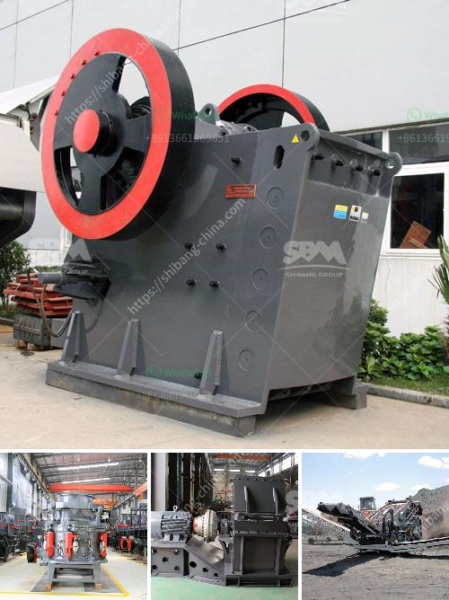

<h3>mini rock crusher manufacturer in china</h3>
Mini rock crusher, as the name suggests, is a machine designed to crush larger rock or gravel into smaller pieces. Utilizing certain criteria like the size of the rocks being processed, the capacity of the machine, and the final product size required, a mini rock crusher is capable of crushing rocks into gravel and even into fine dust.

China, being a leading manufacturer of mini rock crushers, has been instrumental in the success of the construction and mining industries. With its sturdy construction and reliable performance, Chinese mini rock crushers have won the trust of customers from various parts of the world.

One of the key reasons why mini rock crushers in China are highly sought after is because they are manufactured using the latest technology and high-quality components. Chinese manufacturers focus on developing machines that are more efficient and offer better productivity. Advanced features like automatic control systems and adjustable settings allow users to tailor the machine according to their specific requirements.

In addition to the technologically advanced features, another reason why Chinese mini rock crushers are popular is their compact size. These crushers are designed to be portable and easily transported to different job sites. Whether it's a small construction project or a large-scale mining operation, mini rock crushers can be conveniently used in various locations without any hassle. The compact size of these crushers also ensures that they can be stored easily, occupying minimal space.

Chinese manufacturers also understand the importance of cost-effectiveness and offer mini rock crushers at competitive prices. This has made them the preferred choice of many contractors and businesses. Moreover, Chinese manufacturers have a reputation for providing excellent after-sales service and support. They ensure that any issues or problems with their products are promptly resolved, ensuring customer satisfaction.

Another advantage of mini rock crushers manufactured in China is their versatility. These crushers can not only crush rocks and gravel but also process other materials like concrete, asphalt, and brick. This makes them suitable for a wide range of applications, from construction and mining to recycling and demolition.

Furthermore, Chinese mini rock crushers are environmentally friendly. They are designed to operate with low noise and emissions, ensuring minimal impact on the surrounding environment. With growing global concerns about climate change and sustainability, the use of environmentally friendly machines has become a top priority for many industries.

In conclusion, mini rock crushers manufactured in China have gained popularity globally due to their advanced technology, compact size, cost-effectiveness, versatility, and environmental friendliness. These crushers have revolutionized the construction and mining industries by providing efficient and reliable solutions for crushing rocks and gravel. As the demand for mini rock crushers continues to grow, Chinese manufacturers are expected to play a crucial role in meeting this demand and contributing to the growth of these industries.
<h3>Contact us</h3><ul><li><strong>Whatsapp:&nbsp;<a href="https://wa.me/8613661969651">+8613661969651</a></strong></li><li><a href="https://swt.shibang-china.com/?git&amp;zhl&amp;mini rock crusher manufacturer in china"><strong>Online Service(chat now)</strong></a></li></ul><h3>Related</h3><ul><li><a href='jaw crusher types.md'>jaw crusher types</a></li><li><a href='quarry stone dressing machine.md'>quarry stone dressing machine</a></li><li><a href='ball mills manufacturers in india.md'>ball mills manufacturers in india</a></li><li><a href='mobile crushing unit.md'>mobile crushing unit</a></li><li><a href='high energy ball milling process.md'>high energy ball milling process</a></li></ul>