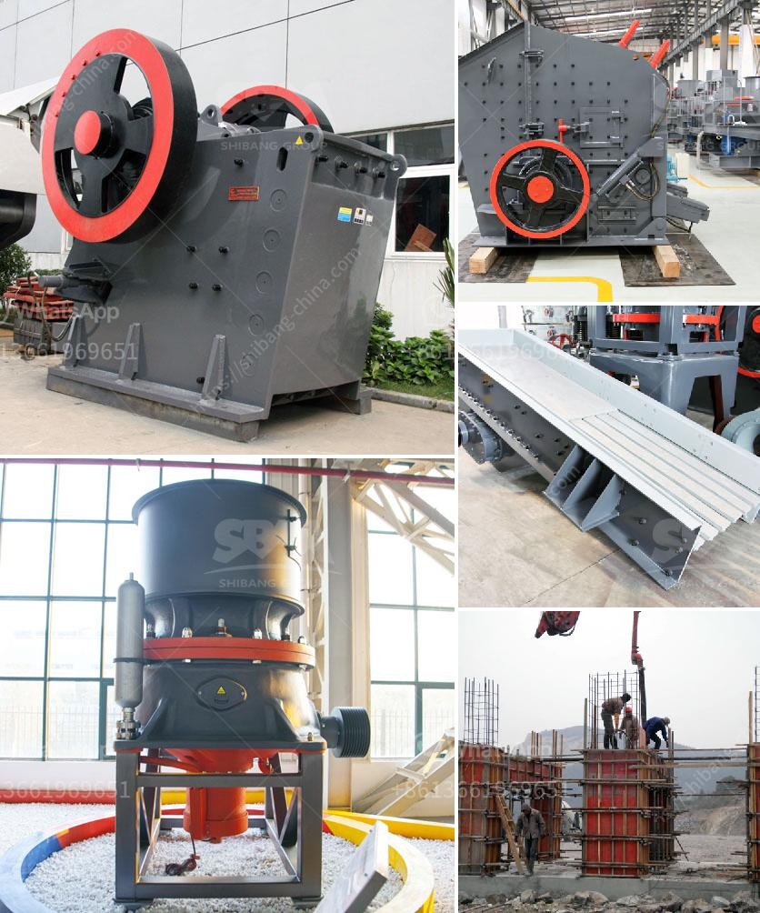

<h3>mini rock crusher</h3>
The mini rock crusher, also known as a small scale stone crushing machine, is a powerful rock crushing equipment capable of crushing various hard ores and rocks. It is especially used for crushing limestone, quartz, granite, iron ore, brick, tile, and other materials with compressive strength under 320MPa.

With its small size, the mini rock crusher is portable and easy to use. This small crusher can be used in any location, making it perfect for remote areas as well. This crushing machine is very efficient and highly effective, allowing for easy and precise crushing of materials.

One of the key features that this mini crusher offers is its ability to crush rocks into gravel, smaller stones, or even dust particles. This makes it ideal for construction projects, where rock or stone materials are needed to build or improve roads, buildings, or other structures. The crushed materials can also be used as a base layer for garden paths, driveways, or parking lots.

Another advantage of the mini rock crusher is its simplicity in operation. This crushing machine does not require any special skills or training to operate. Its user-friendly design allows anyone, even those with no prior experience, to easily operate and maintain the crusher.

In addition to its practical uses in construction and landscaping, the mini rock crusher also has a wide range of applications in the mining industry. It can be used to crush and process various types of ores, including gold, silver, copper, iron, and zinc. The crushed materials can be used to extract valuable minerals or produce other useful products.

The mini rock crusher is also environmentally friendly. It produces less noise and dust than other types of crushers, making it a safer choice for both workers and nearby residents. Additionally, this crusher consumes less energy and has a lower carbon footprint compared to larger crushers, reducing the overall impact on the environment.

When choosing a mini rock crusher, there are several factors to consider. The first is the size of the rocks or stones that need to be crushed. Different models have different capacities and can handle different sizes of materials.

Other features to consider include the power source, whether it is electric, diesel, or gas-powered, and the ease of maintenance and repair. It is also important to choose a reputable manufacturer or supplier to ensure the quality and reliability of the crusher.

In conclusion, the mini rock crusher is a useful tool for construction, mining, and landscaping projects. It is highly versatile, efficient, and easy to use, making it a valuable asset for any project that requires crushing and processing of rock or stone materials. Whether used for roads, buildings, or mining operations, the mini rock crusher is a reliable and affordable solution that can significantly improve productivity and efficiency.
<h3>Contact us</h3><ul><li><strong>Whatsapp:&nbsp;<a href="https://wa.me/8613661969651">+8613661969651</a></strong></li><li><a href="https://swt.shibang-china.com/?git&amp;zhl&amp;mini rock crusher"><strong>Online Service(chat now)</strong></a></li></ul><h3>Related</h3><ul><li><a href='ball mill for silica powder.md'>ball mill for silica powder</a></li><li><a href='how much is a crusher mincer in malaysia.md'>how much is a crusher mincer in malaysia</a></li><li><a href='quartz powder making machine.md'>quartz powder making machine</a></li><li><a href='stone pickers machine in india.md'>stone pickers machine in india</a></li><li><a href='tata stone crusher machines nairobi.md'>tata stone crusher machines nairobi</a></li></ul>