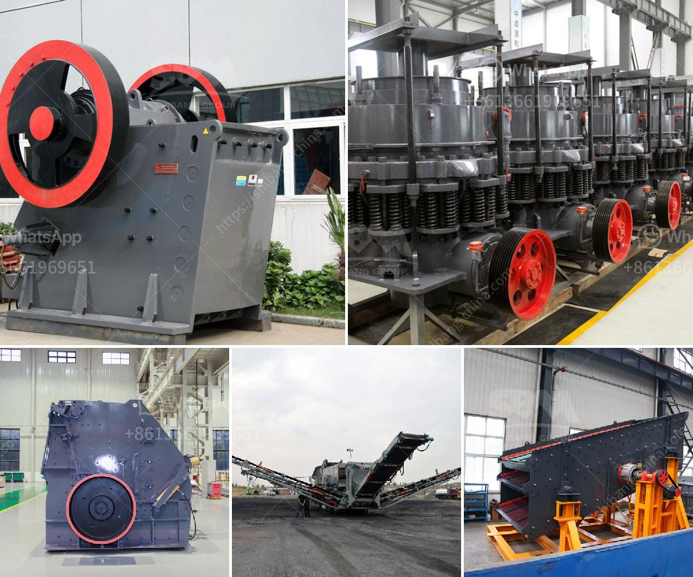

<h3>mini stone crusher for sale philippines</h3>
Mini stone crusher for sale Philippines is a modern and efficient crushing machine. It is a versatile equipment that is used for crushing a wide range of hard materials. This machine can be transported easily and has a compact size. It is highly efficient and can be used for both primary and secondary crushing.

The mobile stone crusher is equipped with a compact yet powerful diesel engine, which allows for efficient operation in any location. It features a high crushing ratio and can easily crush rocks of different sizes. The machine has a robust construction and is built to withstand heavy-duty applications. It is an ideal choice for contractors who need to crush stones on-site.

One of the main advantages of the mini stone crusher is its flexibility. It can be used in different types of applications, such as recycling, mining, and construction. The machine can crush stones to a smaller size, which makes it easier to transport and store. This saves time and money, as there is no need to hire additional equipment for crushing the stones. The crushed stones can also be used as aggregate in concrete, which further reduces the cost of construction.

The mini stone crusher is easy to operate and maintain. It comes with a user-friendly control panel that allows the operator to adjust the settings according to the required output size. The machine is also equipped with safety features to ensure the safety of the operator. It has a protective guard over the crusher opening to prevent accidental injuries. The machine also has an automatic lubrication system to ensure smooth operation and prolong the lifespan of the machine.

In addition to its compact size and versatility, the mini stone crusher also offers excellent performance. It has a high crushing capacity and can produce high-quality aggregates. The machine has a unique design that allows for efficient crushing and screening. It can process a wide range of materials, including concrete, granite, limestone, and more. The machine is also equipped with an adjustable inlet opening, which allows for easy feeding of materials.

Overall, the mini stone crusher for sale Philippines is an excellent investment that can provide value for money. It provides a cost-effective solution for crushing stones on-site, saving the contractor time and money. The machine is versatile and can be used in various applications. It is easy to operate and maintain, allowing for efficient crushing and screening. Whether for recycling, mining, or construction, the mini stone crusher is a reliable and efficient machine that offers excellent performance.
<h3>Contact us</h3><ul><li><strong>Whatsapp:&nbsp;<a href="https://wa.me/8613661969651">+8613661969651</a></strong></li><li><a href="https://swt.shibang-china.com/?git&amp;zhl&amp;mini stone crusher for sale philippines"><strong>Online Service(chat now)</strong></a></li></ul><h3>Related</h3><ul><li><a href='lime grinding machine manufacturer in kolhapur.md'>lime grinding machine manufacturer in kolhapur</a></li><li><a href='marble crusher manufacturer.md'>marble crusher manufacturer</a></li><li><a href='crusher and wash plant for sale in china.md'>crusher and wash plant for sale in china</a></li><li><a href='crusher machine factories in coimbatore.md'>crusher machine factories in coimbatore</a></li><li><a href='rock crusher for chromium or chromite ore.md'>rock crusher for chromium or chromite ore</a></li></ul>