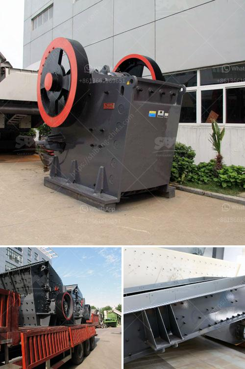

<h3>mining belt conveyor price</h3>
A belt conveyor is an essential tool in the mining industry. They are used to efficiently and continuously transport large quantities of raw materials, such as coal, ore, sand, or gravel, from one location to another. The high demand for such materials requires mining companies to invest in robust and reliable conveyor systems. However, one key factor that mining companies must consider is the price of these belt conveyors. In this article, we will explore the different factors that influence the mining belt conveyor price.

1. Conveyor Length and Width: The length and width of the conveyor belt are crucial factors that impact its price. Mining operations vary in size and scale, so the conveyor length and width requirements can differ significantly. Longer and wider conveyors involve more material and more complex construction, leading to higher costs. It is essential to assess the specific needs of your mining operation to determine the appropriate dimensions for your conveyor system.

2. Material and Construction: The materials used in the construction of the conveyor belt also affect its price. High-quality materials, such as steel and rubber, provide durability and strength, but they may come at a higher cost. Various components, such as idlers, pulleys, and drive systems, also play a role in the conveyor's price. Selecting the right balance between quality and cost is crucial to ensure the conveyor's longevity and reliability.

3. Power and Speed Requirements: Conveyor systems require power to operate efficiently. The power and speed requirements of the conveyor will influence the motor size and energy consumption, thus impacting the price. Higher power and speed requirements will necessitate more robust motors and drive systems, contributing to a higher overall cost. Accurately determining the necessary power and speed requirements of your mining operation is essential to strike the right balance between performance and price.

4. Load Capacity: The load capacity of the conveyor belt is a critical factor that affects its price. Mining operations often require conveyors to transport heavy and bulky materials. A higher load capacity necessitates stronger belts, more robust construction, and additional support elements, resulting in a higher price. Evaluating your mining operation's load capacity needs is crucial to ensure your conveyor system can handle the desired materials efficiently.

5. Maintenance and Support: Proper maintenance and support are vital to keep the conveyor system running smoothly. Mining companies should consider the ongoing maintenance, repair, and support requirements when evaluating the price. It is essential to partner with a reliable supplier that offers comprehensive support services to ensure optimal performance and reduce downtime.

In conclusion, the price of mining belt conveyors is influenced by various factors. Conducting a detailed analysis of your mining operation's specific requirements is essential to determine the optimal conveyor dimensions, the quality of materials used, the power and speed requirements, the load capacity, and the necessary maintenance and support. By taking these factors into account and seeking reputable suppliers, mining companies can strike a balance between cost and performance, ultimately maximizing their operational efficiency.
<h3>Contact us</h3><ul><li><strong>Whatsapp:&nbsp;<a href="https://wa.me/8613661969651">+8613661969651</a></strong></li><li><a href="https://swt.shibang-china.com/?git&amp;zhl&amp;mining belt conveyor price"><strong>Online Service(chat now)</strong></a></li></ul><h3>Related</h3><ul><li><a href='small scale gold mining machine and their price.md'>small scale gold mining machine and their price</a></li><li><a href='stone crusher machine for sale.md'>stone crusher machine for sale</a></li><li><a href='ball mill machine.md'>ball mill machine</a></li><li><a href='belt conveyor calculation sheet.md'>belt conveyor calculation sheet</a></li><li><a href='gold mining and washing machine usa.md'>gold mining and washing machine usa</a></li></ul>