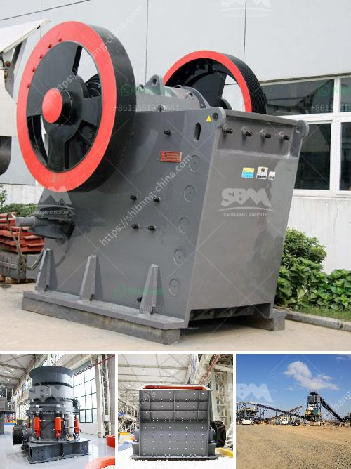

<h3>mining belt conveyor systems</h3>
In the mining industry, heavy-duty belt conveyors are essential equipment to efficiently transport materials from one process or location to another. These systems play a crucial role in enhancing productivity and reducing labor costs while ensuring a safe and reliable operation.

Mining belt conveyor systems consist of multiple components working together to move vast amounts of bulk materials. The core of these systems is the belt itself, which is continuously looped to create an endless conveyor belt. This belt is usually made of durable and robust materials, such as rubber, fabric, or steel, capable of withstanding the harsh mining environment and transporting heavy loads.

One of the significant advantages of belt conveyor systems is their flexibility and adaptability to various mining operations. They can easily navigate through complex terrains, inclines, and declines, making them suitable for open-pit mines, underground tunnels, and even rugged mountainous areas. By utilizing such systems, mining companies can maximize their resource extraction capabilities.

Automation and technology further enhance the efficiency and reliability of mining belt conveyor systems. Advanced control systems enable operators to monitor the conveyor's performance, adjust parameters, and detect faults remotely. This ensures timely preventive maintenance, minimizing downtime and costly repairs. Additionally, sensor technologies can detect potential hazards, such as belt misalignment or excessive heat, helping to prevent accidents and provide a safer working environment.

The environmental impact is another crucial aspect where belt conveyor systems excel. By utilizing these systems, mining companies can significantly reduce fuel consumption and greenhouse gas emissions associated with the use of trucks for material transportation. Consequently, implementing belt conveyors aligns with sustainability goals and contributes to a greener mining industry.

In conclusion, mining belt conveyor systems are indispensable in enhancing efficiency, reducing labor costs, improving safety, and minimizing environmental impacts. These systems offer a reliable, robust, and flexible way to transport bulk materials, meeting the diverse needs of the mining industry. As technology advances, we can expect further optimization and innovation in these systems, paving the way for an even more sustainable and efficient mining sector.
<h3>Contact us</h3><ul><li><strong>Whatsapp:&nbsp;<a href="https://wa.me/8613661969651">+8613661969651</a></strong></li><li><a href="https://swt.shibang-china.com/?git&amp;zhl&amp;mining belt conveyor systems"><strong>Online Service(chat now)</strong></a></li></ul><h3>Related</h3><ul><li><a href='how much is a crusher mincer in malaysia.md'>how much is a crusher mincer in malaysia</a></li><li><a href='roller crusher mill for calcium carbonate.md'>roller crusher mill for calcium carbonate</a></li><li><a href='gold ore ball mill output tph.md'>gold ore ball mill output tph</a></li><li><a href='portable jaw crusher.md'>portable jaw crusher</a></li><li><a href='mining equipment suppliers in south korea.md'>mining equipment suppliers in south korea</a></li></ul>