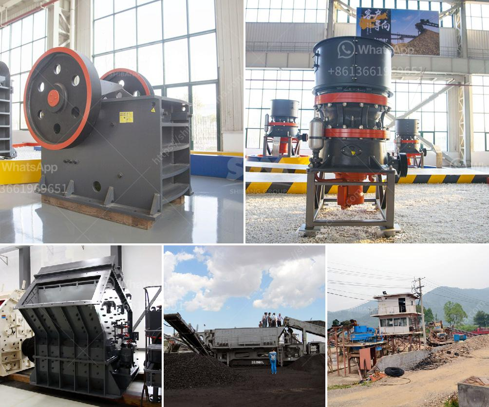

<h3>mining conveyor prices</h3>
Conveyors are an essential component of the mining industry, enabling the efficient transport of bulk materials from one location to another. As mining operations continue to expand, the demand for high-quality conveyors that offer both reliability and cost-effectiveness is on the rise. With the plethora of options available in the market, it is crucial for mining companies to analyze mining conveyor prices and make informed decisions that deliver long-term benefits.

When considering mining conveyor prices, it is important to weigh the initial investment against the potential long-term savings in terms of increased productivity, reduced labor costs, and minimized operational downtime. The upfront cost of acquiring a conveyor system might seem significant, but by prioritizing efficiency and durability, mining companies can make sound investments that yield substantial returns on investment over time.

One factor that impacts mining conveyor prices is the type of conveyor system. Conveyor systems can be categorized into various types, such as belt conveyors, screw conveyors, and bucket elevators, each serving a different purpose in the mining process. Belt conveyors, for instance, are commonly used for the transportation of bulk materials over long distances, offering high capacity and efficient material handling. On the other hand, screw conveyors are ideal for moving small materials or sludges, while bucket elevators are utilized for vertically lifting materials. The type of conveyor required for specific mining operations significantly influences the pricing.

Another key consideration when evaluating mining conveyor prices is the conveyor's design features and specifications. Factors such as the conveyor's length, width, and capacity directly impact the price. Longer conveyors tend to have higher prices due to the additional materials required. The width and capacity of the conveyor also affect the overall cost, as wider and larger capacity conveyors entail more durable components and increased power requirements.

Furthermore, the quality and durability of the materials used to construct the conveyor system directly impact the pricing. Investing in high-quality materials and components may come with a higher upfront cost, but it ensures longevity and reduces maintenance and replacement expenses in the long run. Opting for cheaper alternatives that compromise on quality may result in frequent breakdowns, increased downtime, and higher maintenance costs, ultimately hampering productivity and affecting profitability.

It is essential for mining companies to conduct thorough research and consider companies that offer competitive pricing without compromising on quality and reliability. Requesting detailed price quotes, comparing offerings from multiple suppliers, and assessing customer reviews and testimonials can aid in selecting a conveyor system that offers the best value for money.

In conclusion, mining conveyor prices should be analyzed with a focus on long-term benefits and cost savings. Understanding the various types of conveyors and their respective applications, considering design features and specifications, and prioritizing high-quality materials and construction are crucial when making investment decisions. By choosing the right conveyor system that offers efficiency, reliability, and durability, mining companies can optimize operations, reduce costs, and enhance their overall profitability.
<h3>Contact us</h3><ul><li><strong>Whatsapp:&nbsp;<a href="https://wa.me/8613661969651">+8613661969651</a></strong></li><li><a href="https://swt.shibang-china.com/?git&amp;zhl&amp;mining conveyor prices"><strong>Online Service(chat now)</strong></a></li></ul><h3>Related</h3><ul><li><a href='sand washing equipment for sale.md'>sand washing equipment for sale</a></li><li><a href='gold mining equipment companies in china.md'>gold mining equipment companies in china</a></li><li><a href='aggregate washing plant for sale.md'>aggregate washing plant for sale</a></li><li><a href='small used stone crusher machine in india.md'>small used stone crusher machine in india</a></li><li><a href='industrial hammer mill malaysia.md'>industrial hammer mill malaysia</a></li></ul>