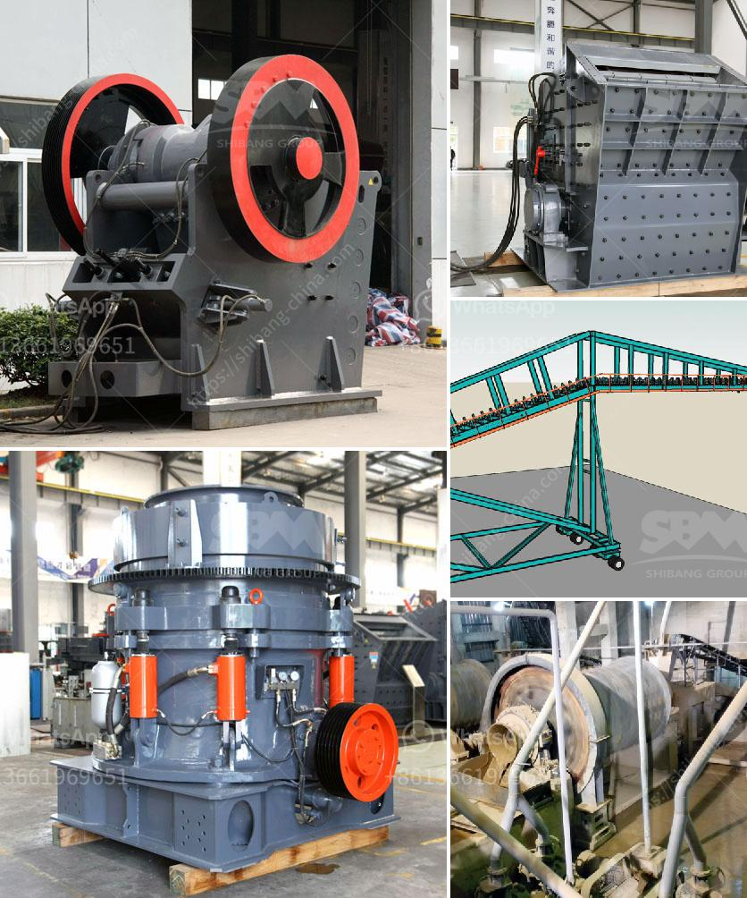

<h3>mining crusher machines in selling in kenya</h3>
Mining industry is booming in East Africa. The region is rich in minerals and holds enormous potential for economic growth and development. The demand for mining crusher machines in Kenya is growing rapidly due to the increasing trend of urbanization, especially in recent years. Kenya has a well-established infrastructure coupled with an increasing number of mining projects. Therefore, mining crusher machines are in high demand in Kenya.

As more and more mining projects are being established in Kenya, the need for advanced technology and machinery is becoming vital. Mining crusher machines are used to break down raw materials into smaller pieces for further processing. With the rapid development in the mining industry, investment in advanced crushing equipment is becoming crucial to increase production capacity and meet the growing demand in the market.

The mining crusher machines are designed to crush hard materials, such as granite, limestone, gravel, and other similar minerals. They are also used to reduce the size of waste materials and recycle them for further use in construction projects. These machines play a vital role in the mining industry by ensuring the efficient extraction and processing of minerals.

Selling mining crusher machines in Kenya can be lucrative if done correctly. One of the key factors to consider is the quality of the machines. Quality machines guarantee increased production capacity and minimal downtime. It is essential to partner with reputable manufacturers and suppliers who provide high-quality mining crusher machines that meet international standards. This ensures that the machines can withstand the harsh mining conditions in Kenya and continue to operate at full capacity.

Additionally, it is crucial to offer after-sales support and services to customers. This includes providing technical assistance, spare parts, and maintenance services. Mining crusher machines undergo wear and tear during operation and may require regular maintenance or replacement of certain parts. By providing reliable after-sales support, customers can trust that their investment is protected and that they will have access to assistance whenever needed.

To successfully sell mining crusher machines in Kenya, it is also important to understand the needs and preferences of the local market. The machines should be tailored to meet the specific requirements of the Kenyan mining industry. For example, the machines should be designed to handle the local types of minerals and crushed materials commonly found in Kenya.

In conclusion, the demand for mining crusher machines in Kenya is growing rapidly due to the increasing number of mining projects and the need for efficient extraction and processing of minerals. Selling mining crusher machines in Kenya can be profitable if done correctly. Key factors to consider include partnering with reputable manufacturers, providing high-quality machines, offering after-sales support, and tailoring the machines to meet the local market's needs. With the right approach and investment, selling mining crusher machines in Kenya can contribute to the growth and development of the mining industry in the country.
<h3>Contact us</h3><ul><li><strong>Whatsapp:&nbsp;<a href="https://wa.me/8613661969651">+8613661969651</a></strong></li><li><a href="https://swt.shibang-china.com/?git&amp;zhl&amp;mining crusher machines in selling in kenya"><strong>Online Service(chat now)</strong></a></li></ul><h3>Related</h3><ul><li><a href='crusher supplier pakistan.md'>crusher supplier pakistan</a></li><li><a href='india second hand ball mill for sale.md'>india second hand ball mill for sale</a></li><li><a href='stone crusher machine for rent or lease india.md'>stone crusher machine for rent or lease india</a></li><li><a href='hammer mill grinder for sale in dubai.md'>hammer mill grinder for sale in dubai</a></li><li><a href='tonne per hour ball mill gold crushing.md'>tonne per hour ball mill gold crushing</a></li></ul>