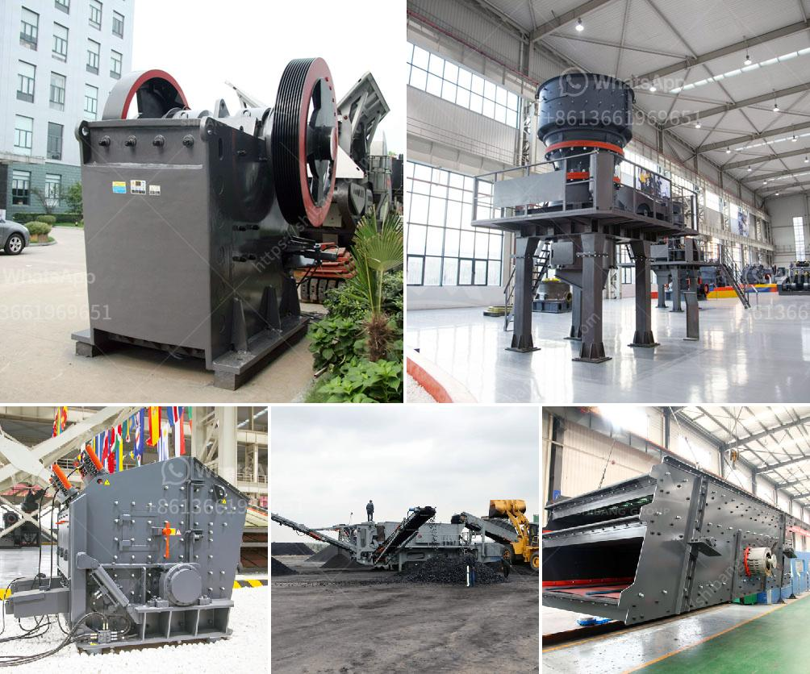

<h3>mining equipment cad blocks</h3>
Mining equipment cad blocks are a valuable tool for professional engineers and designers. CAD blocks can provide accurate, detailed representations of objects, allowing engineers to visualize and plan how equipment will fit into a space before it is physically constructed. This technology can save time and resources by eliminating the need for manual drafting and ensuring that equipment will fit properly in a mine layout.

CAD, short for Computer-Aided Design, refers to the use of computer software to create, modify, or optimize designs. CAD blocks are pre-drawn, standardized symbols or representations of objects that can be easily inserted into a CAD drawing. These blocks can range from simple components like nuts and bolts, to complex machinery, including mining equipment.

Mining equipment cad blocks are particularly useful for designing underground mines as they enable engineers to visualize the equipment in the context of the entire mining operation. For example, an engineer can use these blocks to plan the paths of trucks, haulers, and loaders through a mine, ensuring that traffic flows smoothly and there are no collisions. Furthermore, these CAD blocks can assist in determining the optimal location for machinery, such as crushers, mills, and conveyor systems, to maximize efficiency and productivity.

The benefits of using mining equipment CAD blocks are numerous. Firstly, they save valuable time that would otherwise be spent manually drafting each piece of equipment. CAD blocks can be easily inserted into a drawing, allowing engineers to focus on the overall design rather than individual equipment modeling. Furthermore, these blocks ensure accuracy and consistency in drawings, reducing errors caused by manual drafting.

CAD blocks also enable easier collaboration among engineers and stakeholders. By using standardized symbols, engineers can communicate their design intent more effectively, ensuring that everyone involved understands the layout and configuration of equipment. This can facilitate better decision-making and problem-solving, as all parties have a clear understanding of the design from the start.

Another advantage of mining equipment CAD blocks is their ability to be modified and customized. Designers can easily adjust the size, orientation, and other specifications of the CAD blocks to suit their specific needs. This flexibility allows for quick iteration and refinement of designs, helping engineers to find the most optimal solution for each mining project.

In conclusion, mining equipment CAD blocks are a valuable tool for engineers and designers in the mining industry. They provide accurate, detailed representations of objects, aiding in the visualization and planning of equipment within a mine layout. With their time-saving capabilities, improved collaboration, and flexibility, CAD blocks enhance the efficiency and effectiveness of mine design and construction processes. By adopting CAD technology and utilizing these blocks, mining professionals can optimize their designs, reduce errors, and ultimately enhance the productivity and safety of their operations.
<h3>Contact us</h3><ul><li><strong>Whatsapp:&nbsp;<a href="https://wa.me/8613661969651">+8613661969651</a></strong></li><li><a href="https://swt.shibang-china.com/?git&amp;zhl&amp;mining equipment cad blocks"><strong>Online Service(chat now)</strong></a></li></ul><h3>Related</h3><ul><li><a href='portable jaw crusher.md'>portable jaw crusher</a></li><li><a href='stone crusher hyderabad.md'>stone crusher hyderabad</a></li><li><a href='artificial stone production plant in turkey.md'>artificial stone production plant in turkey</a></li><li><a href='lime stone processing machine.md'>lime stone processing machine</a></li><li><a href='mobile crusher equipment manufacturer.md'>mobile crusher equipment manufacturer</a></li></ul>