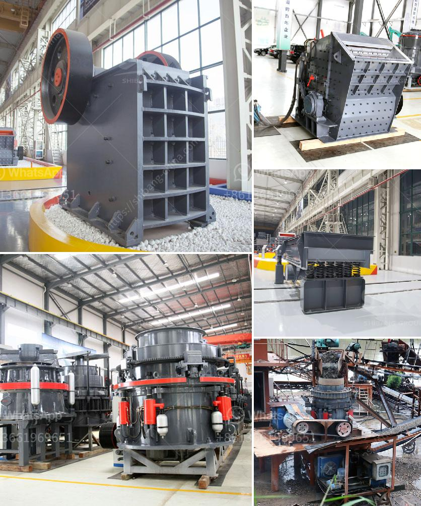

<h3>mining equipment chrome concentrates in turkey</h3>
Turkey is one of the leading producers of chrome concentrates in the world, making it an important player in the mining industry. The country has vast chrome ore reserves, which are extracted through both surface and underground mining methods. To efficiently extract chrome concentrates, specialized mining equipment is required.

One of the key pieces of equipment used in chrome mining is the chrome ore shaking table. This equipment helps in separating high-density chrome ore from the low-density gangue materials, allowing for effective concentration of the valuable chrome concentrates. The shaking table uses a shaking motion to separate the ore particles based on their specific gravity. This process ensures that only the desired chrome concentrates are collected, minimizing waste and maximizing productivity.

Another essential equipment used in chrome mining is the chrome ore magnetic separation plant. This plant utilizes magnetic separation techniques to separate ferromagnetic chrome ore from non-magnetic gangue materials. By doing so, it increases the purity of the chrome concentrates and ensures that only the highest-grade materials are obtained. Magnetic separation is a highly efficient technique and is widely used in the mining industry.

In addition to the shaking table and magnetic separation plant, other specialized mining equipment is also commonly employed. This includes crushers, conveyors, screens, and flotation cells, among others. These machines work together in a coordinated manner to ensure optimal extraction and concentration of chrome concentrates.

Mining equipment for chrome concentrates in Turkey is continually being innovated and upgraded to improve efficiency and productivity. Advanced technologies are being developed to enhance the extraction process and decrease the environmental impact of mining operations. The adoption of these technologies ensures that Turkey remains at the forefront of chrome mining worldwide.

In conclusion, Turkey has a significant presence in the chrome mining industry, with vast reserves of chrome ore. Specialized mining equipment, including shaking tables, magnetic separation plants, and various other machines, are used to extract and concentrate chrome concentrates. Continuous improvements and technological advancements in mining equipment contribute to Turkey's position as a leading producer of chrome concentrates in the global market.
<h3>Contact us</h3><ul><li><strong>Whatsapp:&nbsp;<a href="https://wa.me/8613661969651">+8613661969651</a></strong></li><li><a href="https://swt.shibang-china.com/?git&amp;zhl&amp;mining equipment chrome concentrates in turkey"><strong>Online Service(chat now)</strong></a></li></ul><h3>Related</h3><ul><li><a href='roller mill calcium.md'>roller mill calcium</a></li><li><a href='quarry crusher equipment manufacturer in turkey.md'>quarry crusher equipment manufacturer in turkey</a></li><li><a href='how to make lime powder.md'>how to make lime powder</a></li><li><a href='feldspar ball mill porcess.md'>feldspar ball mill porcess</a></li><li><a href='cement factory plant cost.md'>cement factory plant cost</a></li></ul>