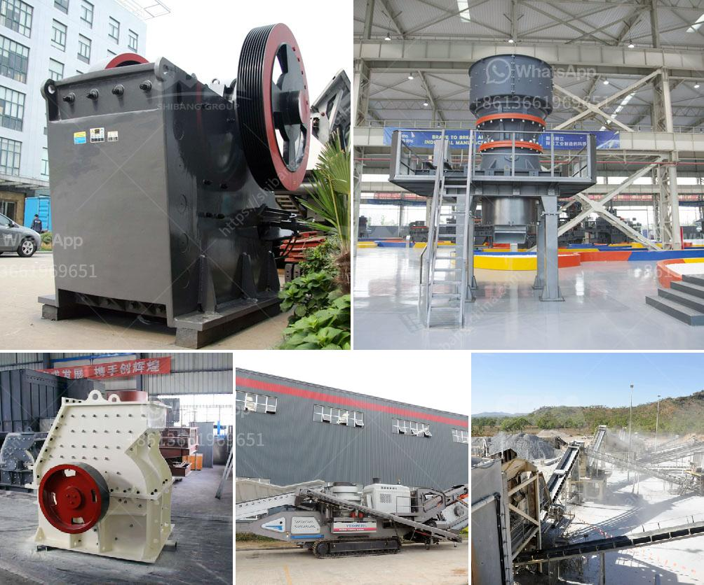

<h3>mining equipment seller in asia</h3>
In recent years, Asia has witnessed a significant surge in the mining sector's growth and development. Alongside these advancements, the demand for high-quality mining equipment has also soared. Nowadays, companies engaged in mining operations recognize the importance of utilizing reliable and efficient machinery to maximize productivity and profitability. This article sheds light on some prominent mining equipment sellers in Asia who have proven their mettle in providing cutting-edge solutions to mining companies in the region.

Caterpillar Inc., a global frontrunner in manufacturing construction and mining equipment, has established a strong presence throughout Asia. Renowned for their durable machinery, Caterpillar offers an extensive range of mining equipment, including bulldozers, excavators, wheel loaders, and more. Their commitment to innovation ensures that their mining equipment remains at the forefront of technology, enhancing operational efficiency and reducing downtime.

A leading provider of advanced machinery and solutions, Sandvik Mining and Rock Technology offers a comprehensive lineup of mining equipment tailored to meet Asia's diverse mining requirements. Their range includes underground drilling equipment, crushers, loaders, and other tools crucial for excavation and material handling. Sandvik's mining equipment is designed to deliver optimal performance, reducing costs while guaranteeing safety and reliability.

Komatsu Ltd., a prominent Japanese manufacturer, boasts a strong reputation in the mining equipment industry. Their technologically advanced equipment, such as hydraulic excavators, dump trucks, and dozers, have proven instrumental in Asia's mining sector. Komatsu's attention to detail, durability, and fuel efficiency ensures high productivity, translating into increased profitability for mining companies.

Hitachi Construction Machinery Co., Ltd. stands among the vanguard of mining equipment suppliers in Asia. Known for their innovation, Hitachi offers a wide variety of mining equipment ranging from hydraulic excavators to rigid dump trucks. Their mining machinery is designed to withstand tough conditions while guaranteeing superior performance, enabling mining companies to execute their operations seamlessly.

Liebherr Group, a Swiss-based multinational company, has gained tremendous recognition as a trustworthy supplier of mining equipment in Asia. Their extensive product portfolio spans mining trucks, cranes, and earthmoving machinery, encompassing a range of solutions that ensure smooth and efficient mining operations. Liebherr's emphasis on sustainability and eco-friendly practices further cements their position as a reliable mining equipment provider.

In Asia's thriving mining industry, choosing the right mining equipment seller is critical for maximizing productivity and profitability. Prominent companies such as Caterpillar Inc., Sandvik Mining and Rock Technology, Komatsu Ltd., Hitachi Construction Machinery Co., Ltd., and Liebherr Group offer a diverse range of machinery, known for their reliability, durability, and innovative features. By deploying advanced mining equipment, companies operating in Asia's mining sector can stay ahead of the competition and achieve optimal results.
<h3>Contact us</h3><ul><li><strong>Whatsapp:&nbsp;<a href="https://wa.me/8613661969651">+8613661969651</a></strong></li><li><a href="https://swt.shibang-china.com/?git&amp;zhl&amp;mining equipment seller in asia"><strong>Online Service(chat now)</strong></a></li></ul><h3>Related</h3><ul><li><a href='medium speed trapezium mill.md'>medium speed trapezium mill</a></li><li><a href='purity chura crushing machine.md'>purity chura crushing machine</a></li><li><a href='stone crushing machines for brick making.md'>stone crushing machines for brick making</a></li><li><a href='coconut shell powder making machine grinding mill for sale.md'>coconut shell powder making machine grinding mill for sale</a></li><li><a href='sand screen with vibrator.md'>sand screen with vibrator</a></li></ul>