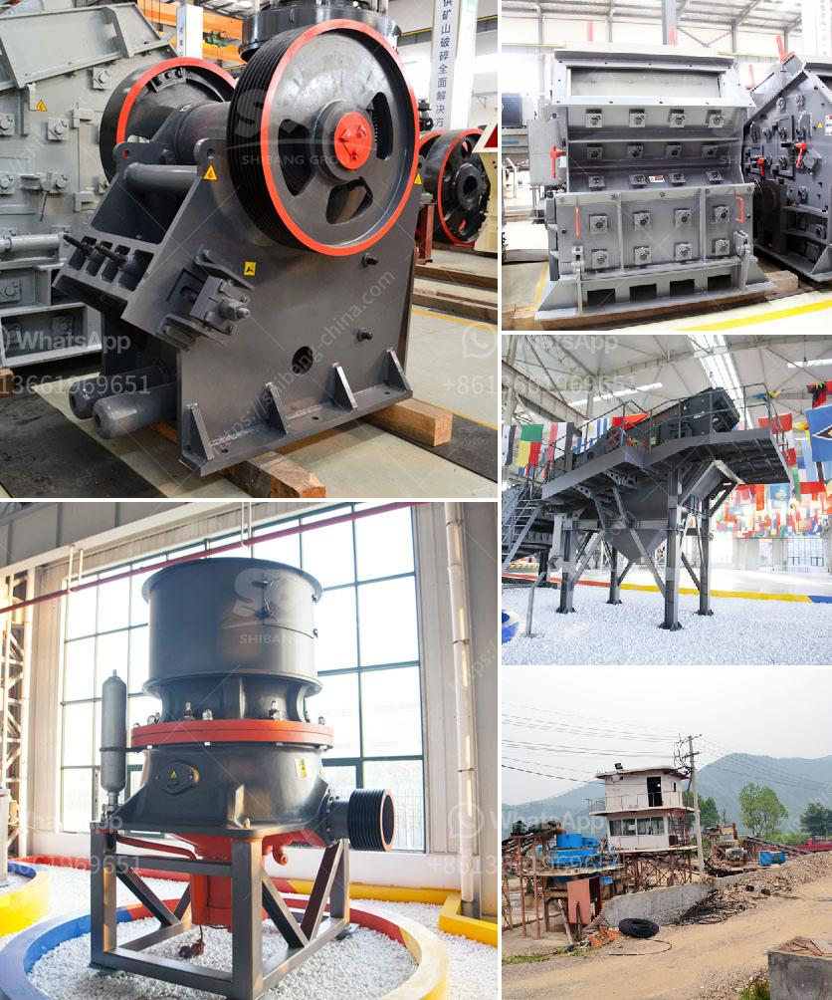

<h3>mining equipment suppliers in south korea</h3>
Mining has been a crucial industry in South Korea for centuries. Since ancient times, the Koreans have been extracting various minerals and metals such as gold, silver, zinc, and copper from their mountains. Today, South Korea is known for its advanced mining industry, which relies heavily on modern equipment and technology. In this article, we will explore some of the top mining equipment suppliers in South Korea.

With its abundance of mineral resources and rich mining history, South Korea has attracted numerous mining equipment suppliers over the years. These suppliers offer a wide range of mining equipment, from mineral extraction machinery to drilling rigs and crushing equipment.

One prominent player in the mining equipment market is Doosan Infracore. Established in 1977, Doosan Infracore is a renowned manufacturer of construction and mining equipment. The company offers a variety of mining equipment, including excavators, loaders, and articulated dump trucks. Doosan Infracore is known for its durability and reliability, making it a preferred choice among mining companies in South Korea.

Another key player in the South Korean mining equipment market is Hyundai Construction Equipment. Hyundai Construction Equipment is a globally recognized brand known for its high-quality machinery. The company offers a diverse range of mining equipment, including excavators, wheel loaders, and backhoe loaders. Hyundai Construction Equipment is known for its innovation and advanced technology, making it a preferred choice among mining industry professionals.

Komatsu is another prominent mining equipment supplier in South Korea. Founded in 1921, Komatsu is a multinational corporation known for its construction and mining equipment. The company offers a range of mining equipment, including hydraulic excavators, bulldozers, and dump trucks. Komatsu focuses on providing innovative solutions to meet the evolving needs of the mining industry.

In addition to these major players, South Korea is also home to several emerging mining equipment suppliers. One such supplier is Hanwha Corporation. Hanwha Corporation offers a wide range of mining equipment, including drilling rigs, tunneling equipment, and mineral processing machinery. The company is committed to developing innovative solutions for the mining industry and has made significant contributions to the advancement of South Korea's mining sector.

Overall, South Korea offers a diverse range of mining equipment suppliers, catering to the needs of both established mining companies and emerging players. These suppliers are known for their quality, durability, and advanced technology. With their contributions, South Korea's mining industry is poised for continuous growth and development.

As the mining industry continues to evolve, it is crucial for mining companies to rely on reliable equipment suppliers who can provide the latest technology and innovative solutions. South Korea's mining equipment suppliers have proven their competence and dedication to meeting the industry's demands. With their support, the mining industry in South Korea is well-positioned for a prosperous future.
<h3>Contact us</h3><ul><li><strong>Whatsapp:&nbsp;<a href="https://wa.me/8613661969651">+8613661969651</a></strong></li><li><a href="https://swt.shibang-china.com/?git&amp;zhl&amp;mining equipment suppliers in south korea"><strong>Online Service(chat now)</strong></a></li></ul><h3>Related</h3><ul><li><a href='cone crusher size.md'>cone crusher size</a></li><li><a href='how much is a crusher mincer in malaysia.md'>how much is a crusher mincer in malaysia</a></li><li><a href='secondary crushing cone crusher drawings.md'>secondary crushing cone crusher drawings</a></li><li><a href='how much does coal mining machines costs.md'>how much does coal mining machines costs</a></li><li><a href='industrial mill crusher price.md'>industrial mill crusher price</a></li></ul>