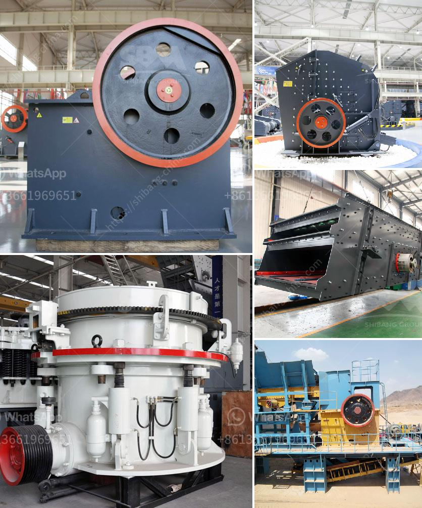

<h3>mining machine and equipments for limestone</h3>
Mining Machine and Equipment for Limestone - The essential tools to extract and process this beautiful natural stone

Limestone is a sedimentary rock composed mostly of calcium carbonate, commonly derived from the remains of marine organisms such as coral or shells. It is known for its natural beauty, durability, and versatility, making it a popular material in construction, architecture, and manufacturing.

To extract limestone from quarries or mines, the use of heavy machinery and equipment is inevitable. While the mining process differs depending on the specific needs of the mine, the overall process remains the same - breaking down the rock to obtain the limestone minerals.

One of the primary machines used in this process is the drilling rig. Drilling rigs bore holes into the earth to reach the limestone deposits. Modern drilling rigs are highly mechanized and equipped with advanced technology to ensure precision and efficiency. They can be operated remotely or by skilled operators, depending on the complexity and scale of the operation.

Once the limestone deposits are reached, explosives may be used to break down the rock into manageable chunks. Explosives are carefully placed and detonated to minimize environmental impact while still being effective in breaking up the limestone. This step requires expert knowledge and adherence to safety protocols.

After the rock is fragmented, front-end loaders or excavators are used to load the limestone onto trucks or conveyor belts for transportation. These heavy machines are capable of handling large volumes of material and are often equipped with advanced hydraulic systems to enhance productivity and safety.

In some cases, crushers are utilized to further break down the limestone into smaller fragments suitable for specific applications. Crushing machines come in different sizes and configurations depending on the desired end product. Jaw crushers and impact crushers are commonly used options for crushing limestone.

Once the limestone has been crushed, it may undergo additional processing steps such as screening or grinding. Screening involves separating the limestone into different sizes using screens or sieves. This process ensures that the limestone meets the required specifications for various applications.

Alternatively, limestone may be ground into a fine powder known as limestone powder or calcium carbonate. Grinding machines such as ball mills or vertical roller mills are commonly used in this process. These machines grind the limestone to a precise size and consistency for further use in a variety of industries, including construction, agriculture, and pharmaceuticals.

Mining machines and equipment used for limestone extraction and processing are designed to withstand harsh conditions and heavy workloads. They are frequently engineered to be highly durable, reliable, and efficient, making them indispensable in limestone mining operations.

It is worth noting that sustainable mining practices have become increasingly important in recent years. Mining companies are now prioritizing environmental conservation and minimizing their ecological footprint. This includes implementing measures such as soil erosion prevention, water conservation, and reclamation projects to restore mined areas back to their natural state.

Mining machines and equipment have revolutionized the extraction and processing of limestone. Their advances in technology, efficiency, and sustainability have made it possible to obtain this remarkable natural stone with minimal impact on the environment. As the demand for limestone continues to grow, the industry is likely to witness further advancements in the machinery and equipment used for mining this valuable resource.
<h3>Contact us</h3><ul><li><strong>Whatsapp:&nbsp;<a href="https://wa.me/8613661969651">+8613661969651</a></strong></li><li><a href="https://swt.shibang-china.com/?git&amp;zhl&amp;mining machine and equipments for limestone"><strong>Online Service(chat now)</strong></a></li></ul><h3>Related</h3><ul><li><a href='gold mining and washing machine usa.md'>gold mining and washing machine usa</a></li><li><a href='stone pickers machine in india.md'>stone pickers machine in india</a></li><li><a href='tempat rental stone crusher.md'>tempat rental stone crusher</a></li><li><a href='how much does coal mining machines costs.md'>how much does coal mining machines costs</a></li><li><a href='rock crusher machine manufacturer.md'>rock crusher machine manufacturer</a></li></ul>