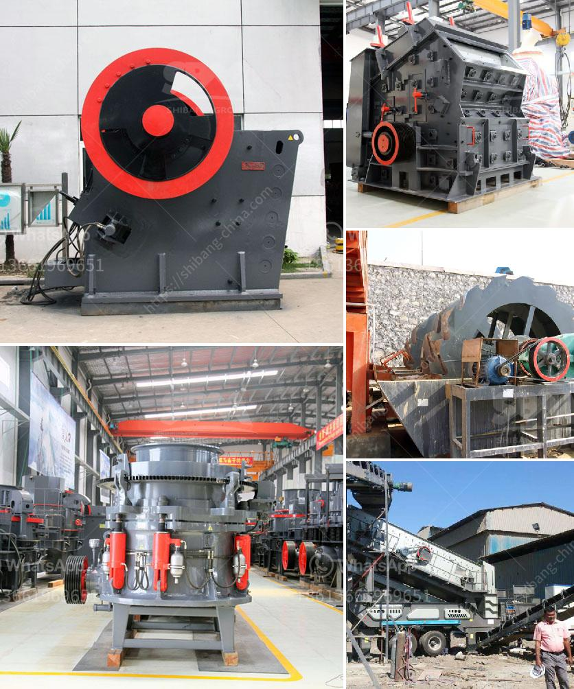

<h3>mining of kaolin clay in nigeria</h3>
In Nigeria, Kaolin clay is abundantly available and found in states such as Plateau, Bauchi, Kogi, Osun, Ogun, and Ekiti. With such vast deposits, the mining of kaolin clay has become an important economic activity across the country.

Kaolin clay, also known as China clay, is a white, soft, and versatile mineral that is used in a variety of industries such as paper production, ceramics, rubber, paint, and cosmetics. One of its main uses is in the manufacturing of porcelain and china wares due to its high temperature resistance and ability to produce a smooth finish.

The mining of kaolin clay in Nigeria is classified under the category of informal mining, which is often a rural activity, undertaken by impoverished individuals or small communities who rely on rudimentary tools and techniques. While this method of mining contributes to the local economy and provides a source of livelihood for many, it is important to promote the adoption of safer and more efficient mining practices to safeguard both the workers and the environment.

The extraction of kaolin clay involves the removal of topsoil layers and overburden to access the clay deposits beneath. This often results in deforestation and habitat destruction, threatening local biodiversity. Therefore, sustainable mining practices that prioritize environmental conservation and land rehabilitation must be implemented.

Additionally, the health and safety of the miners involved in kaolin clay extraction are paramount. The use of proper protective gear, such as masks and gloves, is necessary due to the inhalation of fine clay particles, which may cause respiratory issues. Local communities need to be educated on the potential health hazards associated with mining and the importance of protective measures.

The government should also play a pivotal role in regulating the kaolin clay mining sector, ensuring compliance with environmental and safety standards. By promoting responsible mining practices, Nigeria can maximize the economic benefits of kaolin clay while mitigating its environmental and social impacts.

Overall, the mining of kaolin clay in Nigeria holds immense potential for economic growth and development. However, it is crucial that this industry adopts sustainable practices to protect the environment, safeguard the health and well-being of the miners, and contribute positively to the local communities.
<h3>Contact us</h3><ul><li><strong>Whatsapp:&nbsp;<a href="https://wa.me/8613661969651">+8613661969651</a></strong></li><li><a href="https://swt.shibang-china.com/?git&amp;zhl&amp;mining of kaolin clay in nigeria"><strong>Online Service(chat now)</strong></a></li></ul><h3>Related</h3><ul><li><a href='sand washer turkey.md'>sand washer turkey</a></li><li><a href='rubber grinder machine in philippines.md'>rubber grinder machine in philippines</a></li><li><a href='mining rock quarry crusher for sale.md'>mining rock quarry crusher for sale</a></li><li><a href='ball mill iron ore only company.md'>ball mill iron ore only company</a></li><li><a href='tertiary impact crushers.md'>tertiary impact crushers</a></li></ul>