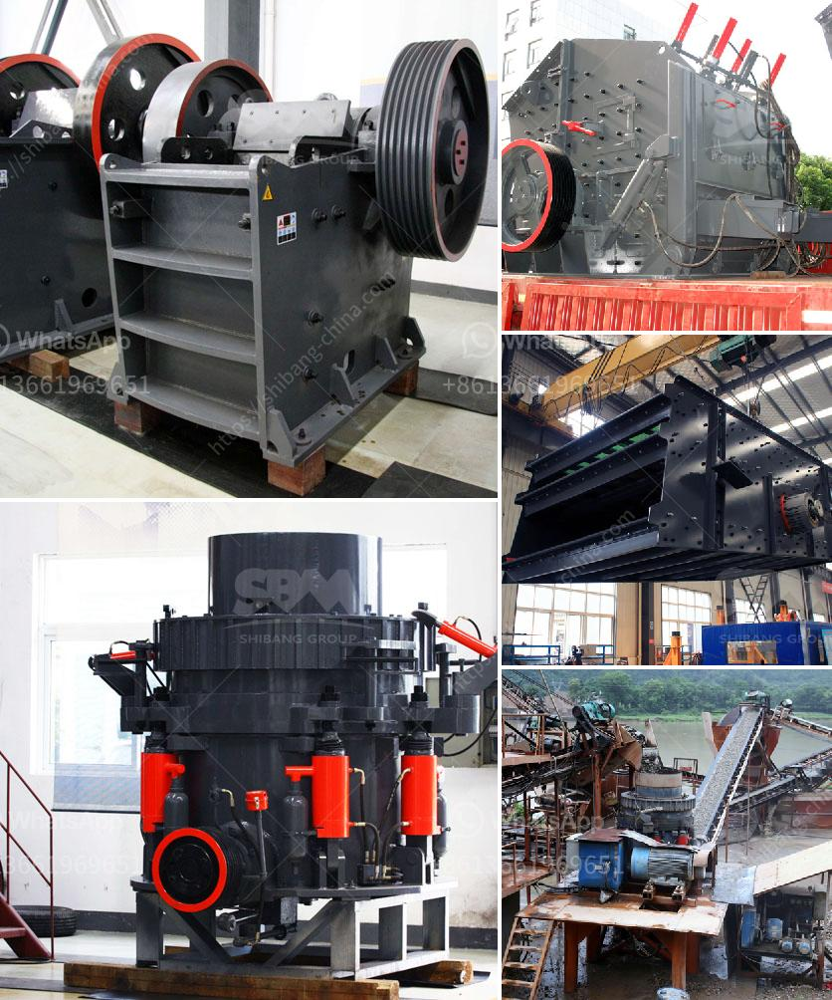

<h3>mining process of dolomite ryamond mill in kenya</h3>
The mining process of dolomite Raymond mill in Kenya involves several steps. First, the dolomite ore is crushed and ground to specified particle sizes by a jaw crusher. The material is then sent to a storage hopper by a bucket elevator, and then continuously and evenly fed into the Raymond mill main grinding chamber through a vibrating feeder for grinding.

The ground dolomite powder is carried by the air flow generated by the fan to the analysis machine for grading. The finer particles are sent back to the Raymond mill for re-grinding, and the larger particles are separated and collected by the cyclone separator and discharged from the discharge port. Finally, the dolomite powder is conveyed by the discharge belt conveyor and stored in the finished product storage bin.

During the mining process of dolomite Raymond mill, various auxiliary equipment is also used to assist in the operation. For example, a jaw crusher is used to crush the raw dolomite ore into smaller particles. A bucket elevator is used to continuously and evenly feed the crushed dolomite into the Raymond mill for grinding. A vibrating feeder helps to achieve a stable and uniform feeding rate. An analysis machine is used to separate the finely ground dolomite powder from the coarser particles. A fan generates the required air flow to transport the ground dolomite powder. A cyclone separator is used to collect the larger particles for re-grinding or disposal. A discharge belt conveyor helps to transport the final dolomite powder to the storage bin.

The mining process of dolomite Raymond mill in Kenya requires a certain degree of automation. The overall operation is monitored by intelligent control systems, which can automatically adjust the grinding parameters according to the actual production conditions, such as the material feed rate, grinding power, and product size distribution. This ensures stable and efficient operation of the Raymond mill, minimizing the downtime and improving the production efficiency.

The mining process of dolomite Raymond mill in Kenya is carried out in strict accordance with environmental regulations. The dust and noise generated during the operation are effectively controlled by dust collectors and mufflers. The Raymond mill is equipped with an efficient bag-type dust collector, which can effectively remove the fine dust particles from the air before it is discharged into the atmosphere. The noise generated by the Raymond mill is also minimized by using soundproof materials and mufflers.

In conclusion, the mining process of dolomite Raymond mill in Kenya involves crushing, grinding, grading, and storage. It requires the use of various auxiliary equipment and adopts intelligent control systems to ensure stable and efficient operation. Environmental protection measures are also implemented to minimize the impact on the environment. The dolomite Raymond mill has become an important equipment for the mining industry in Kenya, providing a reliable and efficient solution for the production of dolomite powder.
<h3>Contact us</h3><ul><li><strong>Whatsapp:&nbsp;<a href="https://wa.me/8613661969651">+8613661969651</a></strong></li><li><a href="https://swt.shibang-china.com/?git&amp;zhl&amp;mining process of dolomite ryamond mill in kenya"><strong>Online Service(chat now)</strong></a></li></ul><h3>Related</h3><ul><li><a href='how to make ganpati with marble powdee.md'>how to make ganpati with marble powdee</a></li><li><a href='jaw crusher construction.md'>jaw crusher construction</a></li><li><a href='250 mesh hammer mill.md'>250 mesh hammer mill</a></li><li><a href='jaw crusher size and capacity.md'>jaw crusher size and capacity</a></li><li><a href='double sided fine grinding machines price.md'>double sided fine grinding machines price</a></li></ul>