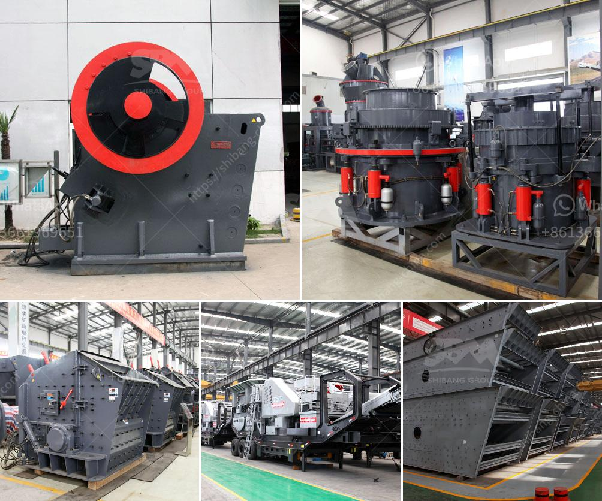

<h3>mining rock quarry crusher for sale</h3>
Mining operations have been conducted in various forms for thousands of years. While initially limited to primitive methods and tools, advancements in technology have led to the development of sophisticated equipment that facilitates efficient and safe mining processes. One such equipment is the rock quarry crusher.

A rock quarry crusher is a device used to crush large quantities of rock into smaller pieces for various applications in industries such as construction, mining, and aggregate production. The crushing process involves three stages: primary crushing, secondary crushing, and tertiary crushing. The primary crusher reduces the size of the rock from as large as several meters to less than 30 centimeters in diameter. The secondary crusher further reduces the rock to sizes that can be handled by the tertiary crusher.

The main advantage of a rock quarry crusher is its ability to produce high-quality crushed materials. These materials can be used in a variety of construction projects, including roads, buildings, bridges, and railways. Moreover, the crushed materials can also be used as aggregate in the production of concrete and asphalt.

One critical factor to consider when purchasing a rock quarry crusher is its capacity to handle the expected volume of materials. Crushers for rock quarry operations typically range in capacity from 100 to 1000 tons per hour. However, the reliability, durability, and efficiency of the crusher are also important factors to consider.

The market offers a wide range of rock quarry crushers for sale, including both stationary and portable options. A stationary crusher is designed to work permanently in one location while a portable crusher can be easily moved from one quarry to another. Portable crushers also provide flexibility when it comes to changing the production site.

In conclusion, a rock quarry crusher plays a crucial role in the mining process. Not only does it help efficiently and effectively extract valuable materials from the earth, but it also contributes to various construction projects. When considering purchasing a rock quarry crusher, it is crucial to evaluate its capacity, reliability, durability, and efficiency to ensure optimal performance in the mining operation.
<h3>Contact us</h3><ul><li><strong>Whatsapp:&nbsp;<a href="https://wa.me/8613661969651">+8613661969651</a></strong></li><li><a href="https://swt.shibang-china.com/?git&amp;zhl&amp;mining rock quarry crusher for sale"><strong>Online Service(chat now)</strong></a></li></ul><h3>Related</h3><ul><li><a href='aggregate crushing processes.md'>aggregate crushing processes</a></li><li><a href='hammer mill components.md'>hammer mill components</a></li><li><a href='250 mesh hammer mill.md'>250 mesh hammer mill</a></li><li><a href='enquiry about sand making machine.md'>enquiry about sand making machine</a></li><li><a href='iron ore mines cost structure.md'>iron ore mines cost structure</a></li></ul>