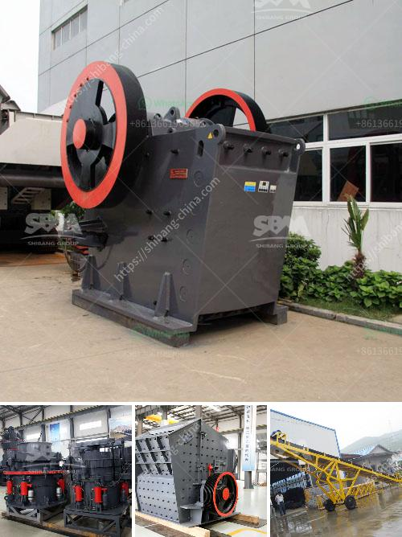

<h3>mobile asphalt plant for sale in dubai</h3>
If you are in the construction industry and are on the lookout for a mobile asphalt plant for sale in Dubai, you are in the right place. Mobile asphalt plants are an essential tool for any construction project as they provide a reliable and efficient solution for producing high-quality asphalt mixes.

Dubai, known for its massive infrastructure projects, is a hub for construction activities. This has led to an increased demand for asphalt plants, allowing contractors to produce asphalt mixes on-site, reducing transportation costs and improving project timelines.

A mobile asphalt plant offers several advantages over traditional stationary plants. Firstly, it provides flexibility as it can be transported easily from one location to another. This is especially useful for projects that require asphalt production at different sites. Mobile asphalt plants are designed to be compact and easy to assemble, making them ideal for construction companies that need to move frequently.

Furthermore, mobile asphalt plants are known for their quick set-up time. They can be up and running within a few hours, reducing downtime and maximizing productivity. This is crucial for construction projects with tight deadlines and limited timeframes.

Another advantage of mobile asphalt plants is their ability to deliver high-quality mixes consistently. These plants are equipped with state-of-the-art technology that ensures the production of asphalt mixes that meet the required specifications. The temperature control system allows the operator to adjust the temperature of the asphalt mix, ensuring optimal performance and durability.

Mobile asphalt plants also have a smaller environmental impact compared to stationary plants. They are designed to be energy-efficient and produce less emissions. This is beneficial for construction companies that prioritize sustainability and want to reduce their carbon footprint.

When looking for a mobile asphalt plant for sale in Dubai, it is important to consider certain factors. Firstly, you should ensure that the plant is of high quality and meets international standards. This ensures that you will get a durable and reliable plant that will last for years.

You should also consider the capacity of the plant, which should be suitable for your specific project requirements. The capacity of mobile asphalt plants can range from 40 to 200 tons per hour, so it is important to choose a plant that can meet your production needs.

Additionally, it is important to consider the after-sales service provided by the manufacturer. A reliable manufacturer will offer comprehensive support and maintenance services to ensure that your plant operates efficiently and smoothly.

In conclusion, a mobile asphalt plant is a valuable investment for construction companies in Dubai. It offers flexibility, quick set-up time, consistent high-quality mixes, and environmental benefits. When choosing a mobile asphalt plant, make sure to consider the quality, capacity, and after-sales service provided by the manufacturer. With the right mobile asphalt plant, you can enhance your construction projects and achieve success.
<h3>Contact us</h3><ul><li><strong>Whatsapp:&nbsp;<a href="https://wa.me/8613661969651">+8613661969651</a></strong></li><li><a href="https://swt.shibang-china.com/?git&amp;zhl&amp;mobile asphalt plant for sale in dubai"><strong>Online Service(chat now)</strong></a></li></ul><h3>Related</h3><ul><li><a href='china roller grinding mill.md'>china roller grinding mill</a></li><li><a href='large capacity ton per hour limestone crushers.md'>large capacity ton per hour limestone crushers</a></li><li><a href='granite crusher machine companies.md'>granite crusher machine companies</a></li><li><a href='used stone crusher in germany.md'>used stone crusher in germany</a></li><li><a href='hydrosizer sand making machine in south africa.md'>hydrosizer sand making machine in south africa</a></li></ul>