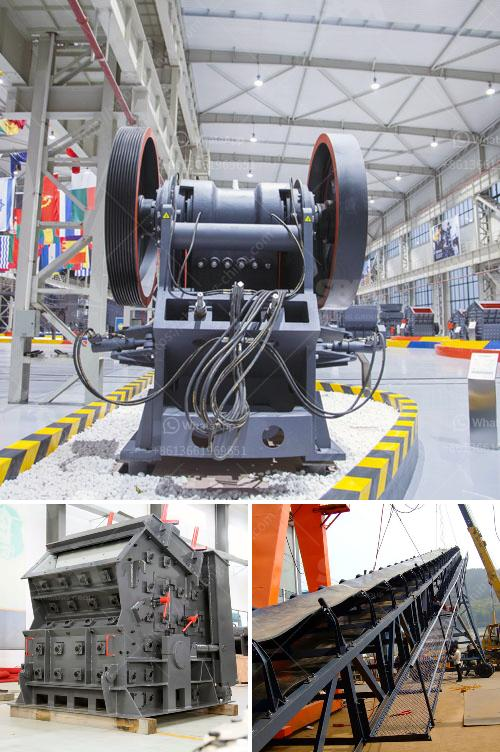

<h3>mobile ball mill for small scale mining</h3>
In recent years, with the advancement of technology, the development of mining equipment has been significantly improved. Mobile ball mill is a new type of equipment developed on the basis of traditional ball mill, which can realize the function of walking, loading and unloading, and can be used for small scale mining consisting of exploration, laboratory and industrial production.

Small scale mining is an essential sector in the mineral extraction industry, providing essential resources to many global economies. Unfortunately, the increasing demand for minerals, combined with the lack of enforcement of regulations and safety measures, puts small-scale miners at risk, often working under hazardous conditions with inefficient and outdated technology.

To address this issue, the introduction of mobile ball mills provides a practical solution for small-scale miners to significantly increase their production efficiency while also reducing the environmental impact. Unlike traditional ball mills that require significant installation time and high maintenance costs, mobile ball mills can be easily transported and assembled at the site, reducing both time and costs.

One of the main advantages of mobile ball mills is their adaptability to different ore types and mining conditions. These mills can be easily adjusted to accommodate various feed sizes, ensuring that the grinding process is efficiently conducted. Additionally, mobile ball mills offer the flexibility to move from one location to another, enabling small-scale miners to follow the available resources.

The mobile ball mill is designed with the advanced technology from Germany and developed based on the research of its predecessors. Mobile ball mill integrates the advantages of traditional ball mill and the most advanced technologies, featuring powerful performance, reasonable structure, high versatility, low noise and high efficiency.

Mobile ball mill can meet the needs of different mineral processing sites and has excellent grinding effect on materials such as limestone, calcite, carbon black, quartz sand, gold sand, and copper ore. It is widely used in the grinding and processing of non-metallic minerals such as bauxite, titanium dioxide, ilmenite, phosphate rock, clay, graphite, calcium carbonate, barite, calcite, gypsum, and dolomite.

In conclusion, mobile ball mills have become increasingly popular among small-scale miners due to their unmatched efficiency and versatility. By bringing the mill to the site, miners no longer have to transport ore to a centralized grinding facility, investing in expensive infrastructure, and dealing with long transportation routes. Instead, they can set up a smaller, more cost-effective operation that allows for greater control and profitability.

The adoption of mobile ball mills in small-scale mining can help transform the sector, making it more efficient and environmentally friendly. As governments and regulatory bodies continue to recognize the importance of sustainable mining practices, mobile ball mills prove to be a practical and forward-looking solution for small-scale miners worldwide.
<h3>Contact us</h3><ul><li><strong>Whatsapp:&nbsp;<a href="https://wa.me/8613661969651">+8613661969651</a></strong></li><li><a href="https://swt.shibang-china.com/?git&amp;zhl&amp;mobile ball mill for small scale mining"><strong>Online Service(chat now)</strong></a></li></ul><h3>Related</h3><ul><li><a href='china stone grinding mill.md'>china stone grinding mill</a></li><li><a href='mobile asphalt plant for sale in dubai.md'>mobile asphalt plant for sale in dubai</a></li><li><a href='chrome washing machine plant eluvial mill gold.md'>chrome washing machine plant eluvial mill gold</a></li><li><a href='chrome beneficiation plant china.md'>chrome beneficiation plant china</a></li><li><a href='ball mill koppers.md'>ball mill koppers</a></li></ul>