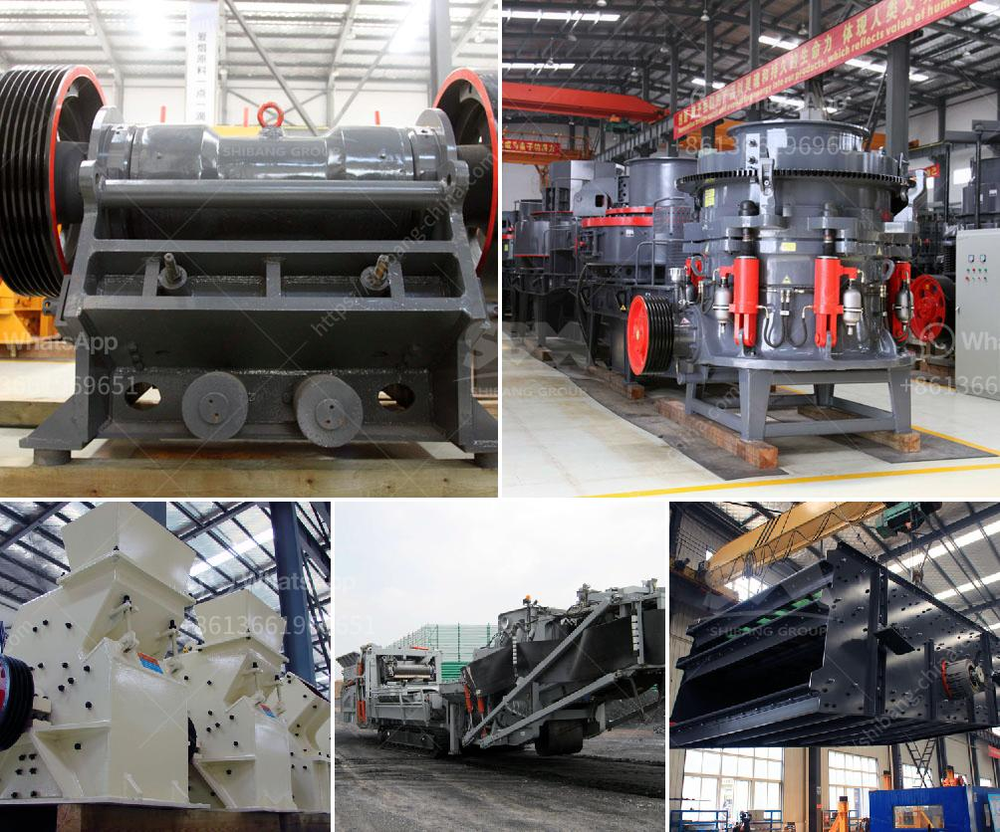

<h3>mobile crusher 70 ton</h3>
Mobile crushers are increasingly popular in the mining and construction industry due to their high efficiency in producing the desired material in a short span of time. With their compact structure and impressive crushing capabilities, these machines are a game-changer for many contractors.

One such mobile crusher that has caught the attention of the industry is the 70-tonne mobile crusher. This crusher is specifically designed to handle large quantities of material and can crush up to 500 tons of raw materials per hour. The machine is equipped with a water spray system that helps to reduce dust and noise levels, making it suitable for use even in densely populated areas.

The 70-tonne mobile crusher offers various benefits to the operators. Its powerful engine enables the machine to work efficiently and shred through the toughest materials, including reinforced concrete and rock. The crusher's advanced technology ensures high-quality end products with a uniform particle size, making it ideal for a wide range of applications such as road construction, demolition, and mining.

One of the key features of this crusher is its mobility. It can be easily transported to different job sites, reducing the need for multiple machines and saving time and resources. This flexibility allows operators to crush and recycle materials onsite, eliminating the need for additional transportation and disposal costs. Furthermore, its compact size and maneuverability make it perfect for operating in tight spaces and challenging terrains.

The 70-tonne mobile crusher is user-friendly and easy to operate. The machine comes with a user-friendly interface and controls that are straightforward and intuitive. Additionally, it is equipped with safety features such as emergency stops and automatic shutdown in case of any malfunctions, ensuring the safety of the operator and the surrounding environment.

The maintenance of this mobile crusher is also hassle-free. The machine is designed with easy access to key components, allowing operators to carry out routine inspections and repairs quickly and efficiently. Additionally, the crusher is equipped with advanced diagnostic tools that help identify any potential issues before they become major problems, minimizing downtime and maximizing productivity.

In conclusion, the 70-tonne mobile crusher is a versatile and efficient machine that is revolutionizing the mining and construction industry. With its powerful engine, high-quality end products, and easy mobility, this crusher offers a range of benefits to operators. Whether it is crushing concrete, rock, or other materials, this mobile crusher is capable of handling large quantities of material in a short span of time. Its user-friendly interface, safety features, and easy maintenance make it a preferred choice for many contractors. If you are in need of a powerful and reliable crusher, the 70-tonne mobile crusher should be on your radar.
<h3>Contact us</h3><ul><li><strong>Whatsapp:&nbsp;<a href="https://wa.me/8613661969651">+8613661969651</a></strong></li><li><a href="https://swt.shibang-china.com/?git&amp;zhl&amp;mobile crusher 70 ton"><strong>Online Service(chat now)</strong></a></li></ul><h3>Related</h3><ul><li><a href='pebble crushing processing.md'>pebble crushing processing</a></li><li><a href='power draw calculator of ball mill.md'>power draw calculator of ball mill</a></li><li><a href='silica washing plant.md'>silica washing plant</a></li><li><a href='granite crushing per tonne.md'>granite crushing per tonne</a></li><li><a href='crusher and screen plant for sale japan.md'>crusher and screen plant for sale japan</a></li></ul>