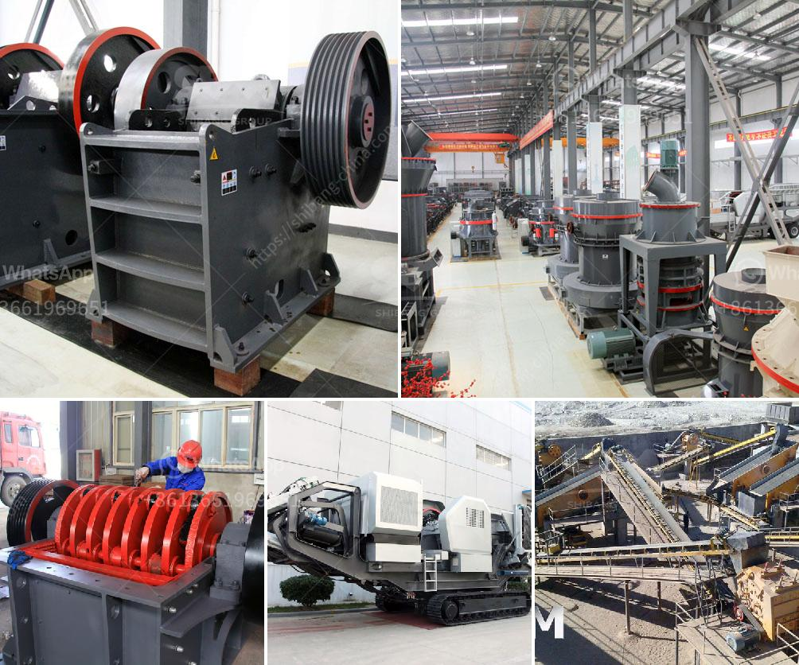

<h3>mobile crusher equipment manufacturer</h3>
In today's era of technological advancements, mobile crusher equipment manufacturers are constantly striving to enhance their products to meet the diverse requirements of construction, mining, and recycling industries. These manufacturers understand that mobility is key in modern crushing operations, and therefore, design their equipment to offer maximum flexibility and maneuverability.

A mobile crusher, as the name suggests, is a machine that crushes large rocks into smaller, more manageable pieces. Utilizing state-of-the-art technology, these machines incorporate advanced features to ensure optimal performance and reliability. With the ability to crush materials directly on-site, mobile crushers eliminate the need for transportation, significantly reducing costs and saving time.

One of the leading mobile crusher equipment manufacturers in the industry is constantly pushing boundaries to develop innovative solutions. They offer a wide range of mobile crushers, each designed for specific applications. From powerful jaw crushers to versatile impact crushers, their machines cater to various crushing needs.

These manufacturers prioritize safety and productivity, incorporating features such as remote-controlled operation and automated processes. Additionally, their equipment is designed to minimize environmental impact through the use of efficient engines and reduced emissions.

Regular advancements in technology allow mobile crusher equipment manufacturers to incorporate cutting-edge features into their machines. For instance, some crushers are equipped with intelligent control systems that optimize performance and adjust settings automatically, based on the material being crushed.

Furthermore, these manufacturers provide comprehensive after-sales service and technical support to ensure their customers' satisfaction. This includes timely spare parts availability, regular maintenance, and prompt troubleshooting assistance.

In conclusion, mobile crusher equipment manufacturers play a crucial role in the construction and mining industries by providing efficient and versatile machines. Through constant innovation and a focus on meeting customer demands, these manufacturers continue to enhance the capabilities of their products. As the demand for mobile crushing solutions grows, these manufacturers are well-positioned to meet the evolving needs of their customers.
<h3>Contact us</h3><ul><li><strong>Whatsapp:&nbsp;<a href="https://wa.me/8613661969651">+8613661969651</a></strong></li><li><a href="https://swt.shibang-china.com/?git&amp;zhl&amp;mobile crusher equipment manufacturer"><strong>Online Service(chat now)</strong></a></li></ul><h3>Related</h3><ul><li><a href='manufacturer of jaw crusher.md'>manufacturer of jaw crusher</a></li><li><a href='machine de fabrication de sable de platre.md'>machine de fabrication de sable de platre</a></li><li><a href='cone crusher spare parts.md'>cone crusher spare parts</a></li><li><a href='cost cement plant manufacturers and cost.md'>cost cement plant manufacturers and cost</a></li><li><a href='double sided fine grinding machines price.md'>double sided fine grinding machines price</a></li></ul>