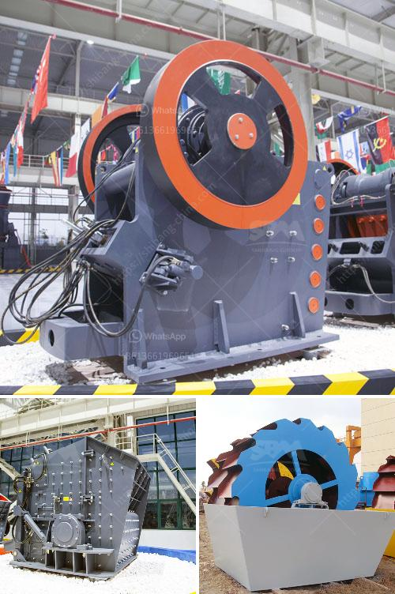

<h3>mobile crusher indonesia hire mines crusher for sale</h3>
Indonesia is rich in natural resources such as coal, gold, tin, iron ore, copper ore, and bauxite. Among these resources, coal is a crucial part of Indonesia's economy. With the growing demand for coal, crushers are used to break down the large rocks into smaller, more manageable sizes.

Portable crushers are essential for various activities on construction sites. Mobile crushers, especially mobile jaw crushers, are widely used for crushing raw materials and solid bulk materials into smaller pieces. To ensure optimal efficiency, the mobile jaw crusher needs to have a good feed level and a homogeneous feed. Our mobile crusher is designed to be easily transported to any difficult site, so it excels at reducing large stones into smaller, more manageable sizes.

Mobile crushers are highly efficient, flexible, and easy to transport. They can be used in mining operations, recycling projects, demolition industries, and more. Compared to stationary crushers, mobile crushers offer several advantages. Firstly, they have lower operational costs since they require less space and energy. Secondly, they offer greater flexibility as they can be easily moved to different locations on site, allowing for better utilization of resources.

Additionally, our mobile crushers are equipped with advanced technology that ensures high performance and reliability. The machines are designed with a robust structure to withstand harsh working conditions, making them suitable for various mining operations. They are also equipped with features like automatic control systems, which improve operational efficiency and reduce the risk of human error.

Hiring a mobile crusher in Indonesia has become a popular option for various mining operations. With the increasing demand for coal, experts predict that the coal market in Indonesia will grow significantly in the coming years. To meet this demand, we recently expanded our services to include mobile crushing. We are now able to provide our clients with a wide range of crushing equipment, including jaw crushers, cone crushers, and impact crushers.

Mobile crushers are also highly in demand for recycling projects such as construction and demolition waste. As urban populations continue to grow, the need to recycle construction waste becomes more critical. Mobile crushers allow for on-site processing of these materials, reducing transportation costs and the need for landfill space.

In conclusion, mobile crushers are essential equipment in mining operations and various industries. They offer several advantages over stationary crushers, including lower operational costs, greater flexibility, and advanced technology. Hiring a mobile crusher in Indonesia can significantly improve the efficiency of mining operations and contribute to the country's economic growth.
<h3>Contact us</h3><ul><li><strong>Whatsapp:&nbsp;<a href="https://wa.me/8613661969651">+8613661969651</a></strong></li><li><a href="https://swt.shibang-china.com/?git&amp;zhl&amp;mobile crusher indonesia hire mines crusher for sale"><strong>Online Service(chat now)</strong></a></li></ul><h3>Related</h3><ul><li><a href='coal crushing plant price.md'>coal crushing plant price</a></li><li><a href='industrial mill price industrial mill.md'>industrial mill price industrial mill</a></li><li><a href='marcasite ball mill.md'>marcasite ball mill</a></li><li><a href='mobile crusher plant supplier in the philippines.md'>mobile crusher plant supplier in the philippines</a></li><li><a href='allis chalmers gyratory crushers.md'>allis chalmers gyratory crushers</a></li></ul>