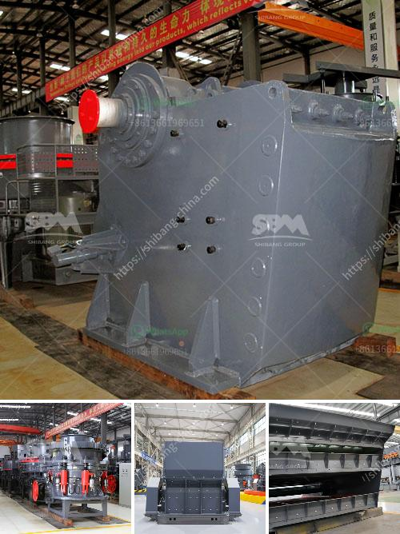

<h3>mobile crusher machine for sale</h3>
The mobile crusher machine for sale is designed for mineral ore processing line. In Cameroon, the mobile jaw crusher plant machine is widely used in the field of mining, coal mine and construction waste recycling, and performs well on the site of earthwork, urban infrastructure construction, road construction and construction field.

Portable crawler crushing and screening plant has the feature of multifunction operation. Through the crushing equipment, screening equipment and conveying equipment, the mobile jaw crusher plant machine can meet the needs of different customers. It is applicable to various crushing processes and requirements, such as mobile crushing and screening station, construction waste crushing station, mining and crushing and screening plant.

The mobile jaw crusher plant machine is equipped with a high-performance mobile jaw crusher plant machine, as well as a vehicle-mounted feeder and a car belt conveyor. The machine is short in length and light in weight;Strong adaptability to mobility, flexible combination of material transportation costs, regardless of coarse crushing, fine crushing or sand making, the design concept is to fully adapt to the various situations of mobile crushing, and eliminate the obstacles to the work site area, crushing site, environment and basic configuration.

Tracked mobile jaw crusher plant is designed and manufactured with Dewo self-developed technology, and it has reached the world advanced level. The plant adopts first level mobile crushing technology which fully meets the customer’s requirements for mobile crushing and changes your profit mode .

Scope of use: It can be widely used in minerals and hardrock crushing, aggregate processing, construction wast recycling, slag processing, tunnel crushing and cement raw materials processing, etc. In addition, the plant can be customized, and different configurations can be introduced to meet the needs of various customers.

Overall, with the mobile jaw crusher plant machine, you can get high production capacity; It has highly mobility, can be extended with the raw material or construction site, and can be put into production quickly;

The integration of the whole set of production line: The basic installation form of the equipment eliminates the complicated installation of the infrastructure and reduces the consumption of materials and man-hours. The reasonable and compact layout of the unit improves the flexibility of the site stationed.

In conclusion, the mobile jaw crusher plant machine is a best choice for mineral ore processing line. It is suitable for primary and secondary crushing of all kinds of minerals and rocks with compressive strength less than 320 MPa.
<h3>Contact us</h3><ul><li><strong>Whatsapp:&nbsp;<a href="https://wa.me/8613661969651">+8613661969651</a></strong></li><li><a href="https://swt.shibang-china.com/?git&amp;zhl&amp;mobile crusher machine for sale"><strong>Online Service(chat now)</strong></a></li></ul><h3>Related</h3><ul><li><a href='china crusher plant.md'>china crusher plant</a></li><li><a href='concrete crusher plant.md'>concrete crusher plant</a></li><li><a href='lime stone crusher rotor.md'>lime stone crusher rotor</a></li><li><a href='stone crusher equipment manufacturer made in canada.md'>stone crusher equipment manufacturer made in canada</a></li><li><a href='mill grinder for sale.md'>mill grinder for sale</a></li></ul>