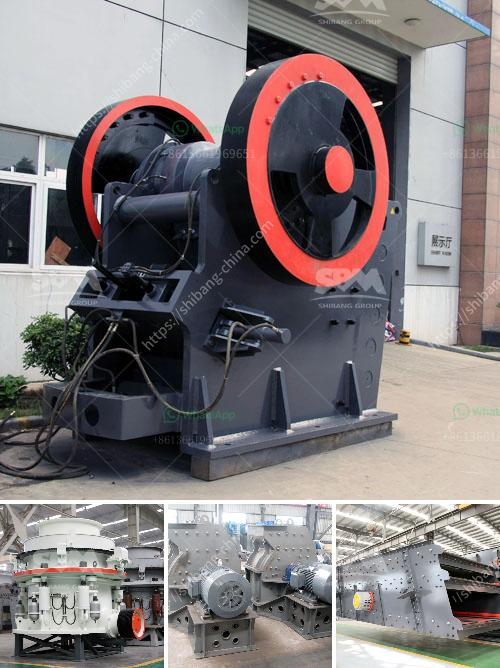

<h3>mobile crusher machine price</h3>
Mobile crusher is a kind of mining machinery and equipment with functions of feeding, conveying, crushing, sand making and screening. It is mainly used in metallurgy, chemical industry, building materials, water conservancy, power supply and other industries. These industries, especially the highway construction, water conservancy construction project, can be considered as high demand areas of crushing equipment. With the development of the mining and crushing industry, more and more manufacturers have entered the market, which has brought about fierce competition. Under such circumstances, the competitiveness of mobile crusher machine price has also become an important feature.

Mobile crusher machine price is influenced by many factors, such as the production cost, steel price, labor costs, transportation costs, etc. The manufacturing cost of mobile crusher machine is mainly composed of raw materials, labor costs, transportation costs, etc. While, the artificial cost includes multiple aspects, such as design, fabrication and transportation costs. Therefore, how to control these costs will affect the amount of investment in mobile crushing plant.

The price of mobile crusher machine is also main factor decided in crushing plant cost. Later, the experts will highlight what the price of mobile crusher machine is. First of all, there are many factors that affect the price of mobile crusher, including the type, model and configuration of mobile crusher. Different types and models of mobile crusher have different prices. Second, the configuration of mobile crusher machine. Mobile crusher machine can be equipped with various crushing and screening equipment according to the actual situation of users. That is to say, customers can choose the most suitable type and model of mobile crusher equipment according to the actual needs. The more complete the tailor-made configuration is, the higher the price will be. 

Additionally, the price of mobile crusher machine will also be influenced by suppliers. The price of equipment from different manufacturers varies greatly. This is because each manufacturer has different judgment on market demand, cost investment and equipment performance. Generally speaking, the equipment produced by well-known manufacturers with advanced technology and high performance will be more expensive.

In summary, the mobile crusher machine price is affected by various factors, such as manufacturing costs, machinery costs, labor costs, transportation costs, technology and innovation. However, the specific price will be determined according to the actual production needs of users. Therefore, customers should make clear the production demand and quality requirements, and then conduct a detailed market research. Comparing the prices and quality of various manufacturers, and choosing the most cost-effective equipment is the key to reduce the cost of the production line and increase the economic benefit.
<h3>Contact us</h3><ul><li><strong>Whatsapp:&nbsp;<a href="https://wa.me/8613661969651">+8613661969651</a></strong></li><li><a href="https://swt.shibang-china.com/?git&amp;zhl&amp;mobile crusher machine price"><strong>Online Service(chat now)</strong></a></li></ul><h3>Related</h3><ul><li><a href='crushing plant coal machine.md'>crushing plant coal machine</a></li><li><a href='crusher made in taiwan.md'>crusher made in taiwan</a></li><li><a href='chrome crusher for sale south africa.md'>chrome crusher for sale south africa</a></li><li><a href='cost cement plant manufacturers and cost.md'>cost cement plant manufacturers and cost</a></li><li><a href='hammer crusher clinker.md'>hammer crusher clinker</a></li></ul>