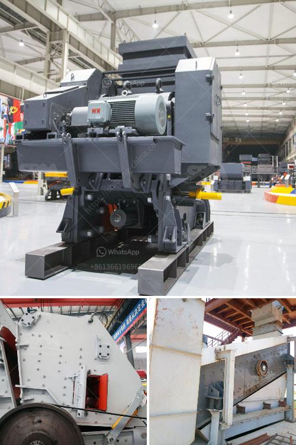

<h3>mobile crusher on hire in tamil nadu</h3>
Mobile crushers are essential for the crushing of materials on construction sites and various other industrial applications. Ensuring the right equipment is available when needed, and hiring a mobile crusher in Tamil Nadu can provide relief from the hassle of disposing leftover construction debris and rubble.

Tamil Nadu, a southern state in India, known for its diverse industries, has a booming construction sector. With numerous infrastructure projects and real estate developments, the demand for efficient and reliable crushers is ever-increasing. Mobile crushers, which can be transported to different locations, are the perfect solution for this demand.

One of the biggest advantages of hiring a mobile crusher is its versatility. These crushers can handle a wide range of materials, including concrete, asphalt, brick, and stone. Depending on the specific model, they can also crush larger rocks and boulders into smaller aggregates or sand. This flexibility allows construction companies to tackle a variety of projects without investing in multiple specialized machines.

Furthermore, hiring a mobile crusher in Tamil Nadu saves time and effort in disposing of construction waste. Instead of manually transporting and disposing of leftover materials, these crushers can process the waste on-site, reducing the need for additional labor and transportation costs. The processed material can then be reused as aggregates for new construction projects, providing a sustainable solution to waste management.

When considering hiring a mobile crusher in Tamil Nadu, it is crucial to choose a reputable rental company. The rental company should have a fleet of well-maintained crushers, ensuring reliability and efficient performance. Additionally, the rental rates should be competitive, and the company should provide timely support and maintenance services.

It is also important to consider the specific requirements of the project before selecting a mobile crusher. Factors such as the required output size, the volume of material to be processed, and the available space on-site can influence the choice of crusher model. Consulting with the rental company's experts can help determine the most suitable crusher for the project's needs.

In conclusion, hiring a mobile crusher in Tamil Nadu offers numerous advantages for construction companies. The versatility, convenience, and cost-effectiveness of these machines make them an essential asset for handling construction waste and crushing various materials. By choosing a reputable rental company and considering the project's specific requirements, construction companies can ensure a smooth and efficient crushing process, contributing to the success of their projects.
<h3>Contact us</h3><ul><li><strong>Whatsapp:&nbsp;<a href="https://wa.me/8613661969651">+8613661969651</a></strong></li><li><a href="https://swt.shibang-china.com/?git&amp;zhl&amp;mobile crusher on hire in tamil nadu"><strong>Online Service(chat now)</strong></a></li></ul><h3>Related</h3><ul><li><a href='mica powder mill equipment supplier.md'>mica powder mill equipment supplier</a></li><li><a href='used crushing machine price.md'>used crushing machine price</a></li><li><a href='high gradient separator in zhengzhou.md'>high gradient separator in zhengzhou</a></li><li><a href='mill grinder for sale.md'>mill grinder for sale</a></li><li><a href='price limestone rock crusher.md'>price limestone rock crusher</a></li></ul>