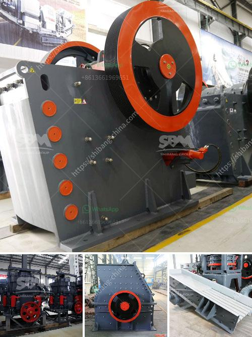

<h3>mobile crusher plant supplier in the philippines</h3>
With the development of the construction industry, the need for more efficient and cost-effective equipment has increased. This is where mobile crusher plant comes in. A mobile crusher plant is a stationery crusher equipment that consists of jaw crusher, cone crusher, vibrating screen, vibrating feeder, and belt conveyor. It is ideal for customers who need to change the working site frequently or for those who process stones in different sites.

In the Philippines, there are many mobile crusher plant manufacturers and suppliers. However, choosing a reliable supplier is a daunting task. Fortunately, with a little knowledge and some evaluation criteria, you can easily find the right supplier for your mobile crusher plant needs.

Firstly, make sure the supplier has a good reputation in the industry. Look for customer reviews, ask for recommendations from colleagues, and check the supplier's website for testimonials. A reputable supplier will have a track record of delivering quality products and providing excellent customer service.

Secondly, consider the supplier's experience and expertise. A supplier with years of experience in the industry will have a deeper understanding of customer needs, production requirements, and the latest technology trends. They will be able to offer valuable insights and advice to help you choose the right mobile crusher plant for your specific needs.

Thirdly, evaluate the supplier's product quality and reliability. The mobile crusher plant should be durable, efficient, and easy to maintain. Look for suppliers who use high-quality materials and have robust construction practices. Additionally, consider the supplier's after-sales service and support. A reliable supplier should offer a comprehensive warranty, spare parts availability, and technical support.

Lastly, compare prices and consider the supplier's pricing strategy. While price is an important factor, it should not be the sole criterion for choosing a supplier. Look for suppliers who offer competitive pricing without compromising on quality.

In conclusion, finding the right mobile crusher plant supplier in the Philippines requires careful evaluation and consideration. By choosing a reputable supplier with experience, expertise, quality products, and competitive pricing, you can ensure the success of your construction projects and achieve your business goals.
<h3>Contact us</h3><ul><li><strong>Whatsapp:&nbsp;<a href="https://wa.me/8613661969651">+8613661969651</a></strong></li><li><a href="https://swt.shibang-china.com/?git&amp;zhl&amp;mobile crusher plant supplier in the philippines"><strong>Online Service(chat now)</strong></a></li></ul><h3>Related</h3><ul><li><a href='list of machineries for marble processing plants.md'>list of machineries for marble processing plants</a></li><li><a href='second hand jaw crusher for sale in malaysia.md'>second hand jaw crusher for sale in malaysia</a></li><li><a href='stone quarries cursher south africa.md'>stone quarries cursher south africa</a></li><li><a href='sale of stone crushers.md'>sale of stone crushers</a></li><li><a href='how to make good with limestone powder.md'>how to make good with limestone powder</a></li></ul>