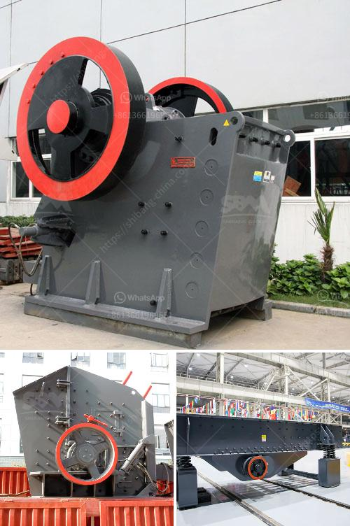

<h3>mobile crusher plants</h3>
Mobile crusher plants are essential for the construction industry. They allow for the crushing of rocks into gravel, smaller rocks, or even dust. These plants are invaluable in terms of efficiency and effectiveness. They allow operators to process material on-site, eliminating the need to transport materials to a stationary crusher.

One of the main benefits of a mobile crusher plant is that it can crush materials at any location, which allows for greater flexibility in terms of production. For example, this means that operators can crush material directly at a construction site, eliminating the need to transport it from a quarry or a mine. This not only saves time but also reduces transportation costs.

In addition to their mobility, these plants also come with various features that enhance their efficiency. Many mobile crusher plants are equipped with a vibrating feeder and a screening system, allowing operators to process different sizes of materials. This is particularly useful in the production of different grades of materials, such as fine sands and aggregates.

Another advantage of mobile crusher plants is that they are environmentally friendly. They are designed to minimize dust and noise pollution, making them suitable for even urban areas. Some plants are also equipped with water sprays to further reduce dust emissions. This ensures compliance with environmental regulations while enabling efficient material processing.

Furthermore, mobile crusher plants are equipped with advanced control systems, making them easy to operate and monitor. Operators can adjust the settings of the crushers and the feeders, ensuring optimal performance and minimizing downtime.

Overall, mobile crusher plants are a game-changer in the construction industry. They offer flexibility, efficiency, and environmental benefits, ultimately contributing to increased productivity and profitability. Whether on a small construction site or a large-scale project, these plants are an essential tool for any construction professional.
<h3>Contact us</h3><ul><li><strong>Whatsapp:&nbsp;<a href="https://wa.me/8613661969651">+8613661969651</a></strong></li><li><a href="https://swt.shibang-china.com/?git&amp;zhl&amp;mobile crusher plants"><strong>Online Service(chat now)</strong></a></li></ul><h3>Related</h3><ul><li><a href='coal crusher machine indonesia supplier.md'>coal crusher machine indonesia supplier</a></li><li><a href='mobile jaw crusher for sale south africa.md'>mobile jaw crusher for sale south africa</a></li><li><a href='quotation for crushing and screening.md'>quotation for crushing and screening</a></li><li><a href='cameroon quarry crusher.md'>cameroon quarry crusher</a></li><li><a href='iron ore beneficiation plant consultants in india.md'>iron ore beneficiation plant consultants in india</a></li></ul>