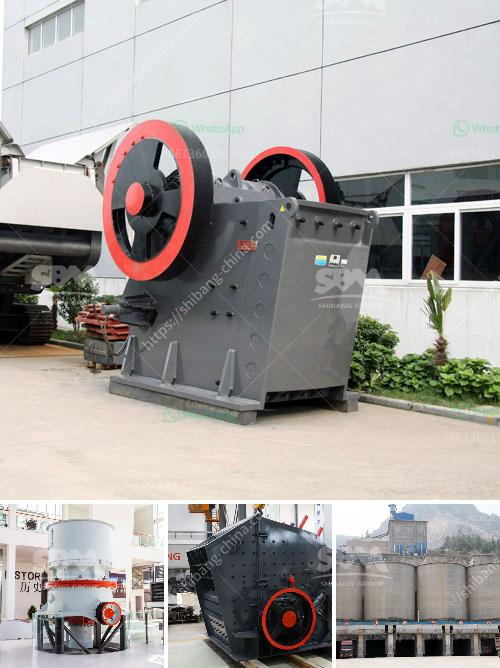

<h3>mobile crushing plants usa</h3>
In recent years, the demand for mobile crushing plants in the USA has been on the rise due to the rapid expansion of the construction industry. These plants are highly versatile and can be used for processing various types of materials, including limestone, granite, concrete, and asphalt. With their ability to be easily transported and set up on site, mobile crushing plants offer a convenient and efficient solution for material processing.

One of the key advantages of mobile crushing plants is their flexibility. Unlike stationary plants, these mobile units can be easily moved from one location to another, allowing for greater accessibility to different job sites. Whether it is a remote construction site or a quarry, mobile crushing plants can be quickly transported and set up, reducing the need for costly transportation and logistics.

Furthermore, mobile crushing plants in the USA are equipped with advanced technology and features that enhance their performance and productivity. For instance, many of these plants are equipped with efficient crushers that can handle large quantities of material and produce high-quality aggregates. Some models even come with screens and conveyors for further processing and sorting of the material.

Another significant advantage of mobile crushing plants is their ability to save time and money. As these plants can be set up on site, there is no need to transport the material to a stationary plant for processing. This not only eliminates the transportation costs but also reduces the time taken for material processing, making mobile crushing plants a cost-effective option.

In addition to their efficiency and cost-effectiveness, mobile crushing plants also offer environmental benefits. With the implementation of various environmental regulations, it is crucial for companies to minimize their impact on the environment. Mobile crushing plants in the USA are designed to meet the strictest emission standards, ensuring compliance with environmental regulations. Furthermore, these plants use less energy compared to traditional crushers, resulting in reduced carbon emissions.

The high demand for mobile crushing plants in the USA can be attributed to their numerous benefits and advantages. Construction companies and contractors find these plants to be an effective solution for material processing, enabling them to save time, money, and resources. Additionally, mobile crushing plants offer flexibility in terms of location and can easily adapt to changing job site requirements.

As the construction industry continues to grow, the demand for mobile crushing plants in the USA is expected to increase further. With their efficiency, versatility, and environmental benefits, these plants offer an ideal solution for material processing. Whether it is for road construction, building projects, or quarry operations, mobile crushing plants are poised to play a key role in meeting the material demands of the industry.
<h3>Contact us</h3><ul><li><strong>Whatsapp:&nbsp;<a href="https://wa.me/8613661969651">+8613661969651</a></strong></li><li><a href="https://swt.shibang-china.com/?git&amp;zhl&amp;mobile crushing plants usa"><strong>Online Service(chat now)</strong></a></li></ul><h3>Related</h3><ul><li><a href='mobile stone crusher from taiwan.md'>mobile stone crusher from taiwan</a></li><li><a href='quarry equipment for railway.md'>quarry equipment for railway</a></li><li><a href='jaw crusher materials.md'>jaw crusher materials</a></li><li><a href='small scale tin mining design.md'>small scale tin mining design</a></li><li><a href='micro powder grinding mill.md'>micro powder grinding mill</a></li></ul>