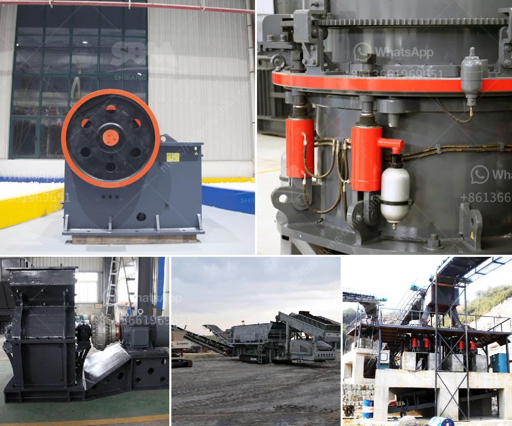

<h3>mobile crushing unit</h3>
Construction and demolition (C&D) waste accounts for a significant portion of landfill waste worldwide. With increasing environmental concerns, there is a growing need for efficient solutions for managing this waste. One such solution is the mobile crushing unit, a pioneering equipment for on-site recycling.

A mobile crushing unit is a compact and flexible piece of machinery designed to crush C&D waste directly on-site. It provides an efficient solution for construction companies and contractors in managing their waste materials. By reducing the need for transporting waste to off-site facilities, mobile crushing units significantly lower transportation costs and minimize the carbon footprint associated with waste disposal.

The versatility of mobile crushing units is one of their key advantages. Equipped with powerful crushers and screens, these units can process a wide range of materials, including concrete, asphalt, bricks, tiles, and rocks. This allows contractors to reuse these materials in new construction projects, reducing the need for virgin materials and promoting sustainability.

Furthermore, mobile crushing units are equipped with sophisticated dust suppression systems, ensuring that the surrounding environment remains unpolluted. This feature is particularly important as construction sites are often located in densely populated areas. By controlling dust emissions, mobile crushing units contribute to a healthier and cleaner living environment for nearby communities.

Not only do mobile crushing units aid in waste management, but they also help streamline construction projects. By processing waste materials on-site, these units eliminate the need for separate waste handling operations, saving time and resources. This leads to faster project completion and improved overall efficiency.

In conclusion, the introduction of mobile crushing units has revolutionized waste management in the construction and demolition industry. Offering an efficient and sustainable solution, these units enable on-site recycling and contribute to the reduction of waste sent to landfills. With their versatility and dust suppression capabilities, mobile crushing units promote a greener and healthier construction environment. As sustainability becomes an increasingly important focus, mobile crushing units are a valuable asset for any construction project.
<h3>Contact us</h3><ul><li><strong>Whatsapp:&nbsp;<a href="https://wa.me/8613661969651">+8613661969651</a></strong></li><li><a href="https://swt.shibang-china.com/?git&amp;zhl&amp;mobile crushing unit"><strong>Online Service(chat now)</strong></a></li></ul><h3>Related</h3><ul><li><a href='crusher price of nigeria.md'>crusher price of nigeria</a></li><li><a href='granite crushing per tonne.md'>granite crushing per tonne</a></li><li><a href='black granite land for sale in tamilnadu.md'>black granite land for sale in tamilnadu</a></li><li><a href='gold ore milling machine.md'>gold ore milling machine</a></li><li><a href='used pioneer jaw crusher.md'>used pioneer jaw crusher</a></li></ul>