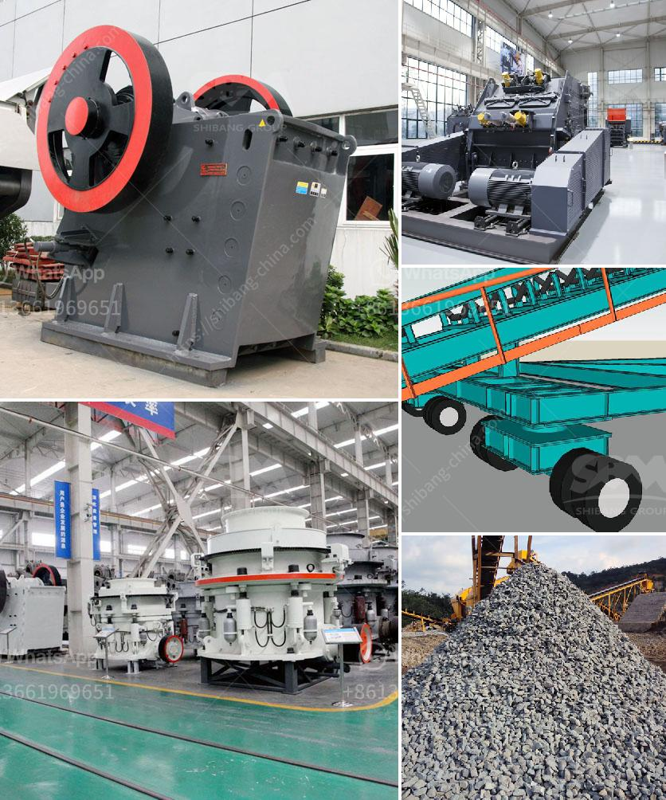

<h3>mobile gold processing plant in germany</h3>
Germany has always been known for its engineering prowess and technological advancements. The latest addition to its list of innovations is the mobile gold processing plant. This state-of-the-art plant is designed to extract gold efficiently and effectively while on the move.

Why is this mobile gold processing plant special? For starters, it allows gold miners to bring the processing plant closer to the source, rather than transporting the raw materials to a central processing facility. This saves time, energy, and resources, making the process more cost-effective.

The mobile gold processing plant in Germany is equipped with advanced machinery and equipment like crushers, screens, and gravity separators. These machines work together to extract gold from the ore. The plant can handle various types of gold ore including low grade and oxidized ore.

Thanks to its mobility, the plant can be easily transported to different mining sites, enabling miners to explore different areas without investing in multiple processing plants. This flexibility not only increases efficiency but also reduces environmental impact.

Moreover, the plant is designed with sustainability in mind. It incorporates modern technology to minimize water and energy consumption, reducing its carbon footprint. This aligns with Germany's commitment to transitioning to a low-carbon economy and promoting sustainable development.

The mobile gold processing plant in Germany has revolutionized the gold mining industry. It provides an efficient and sustainable approach to extracting gold, allowing miners to maximize their yields while minimizing environmental impact. This innovation demonstrates Germany's engineering excellence and its commitment to staying at the forefront of technological advancements.

In conclusion, the mobile gold processing plant in Germany is a game-changer in the gold mining industry. Its mobility and sustainable design make it a valuable asset for miners, increasing their efficiency and reducing their environmental footprint. With this plant, Germany once again showcases its ability to lead the way in technological advancements.
<h3>Contact us</h3><ul><li><strong>Whatsapp:&nbsp;<a href="https://wa.me/8613661969651">+8613661969651</a></strong></li><li><a href="https://swt.shibang-china.com/?git&amp;zhl&amp;mobile gold processing plant in germany"><strong>Online Service(chat now)</strong></a></li></ul><h3>Related</h3><ul><li><a href='second hand gold mining equipments in uk.md'>second hand gold mining equipments in uk</a></li><li><a href='crushing machine in quarry.md'>crushing machine in quarry</a></li><li><a href='mobile crusher machine price.md'>mobile crusher machine price</a></li><li><a href='talc mining crusher process.md'>talc mining crusher process</a></li><li><a href='germany stone crusher.md'>germany stone crusher</a></li></ul>