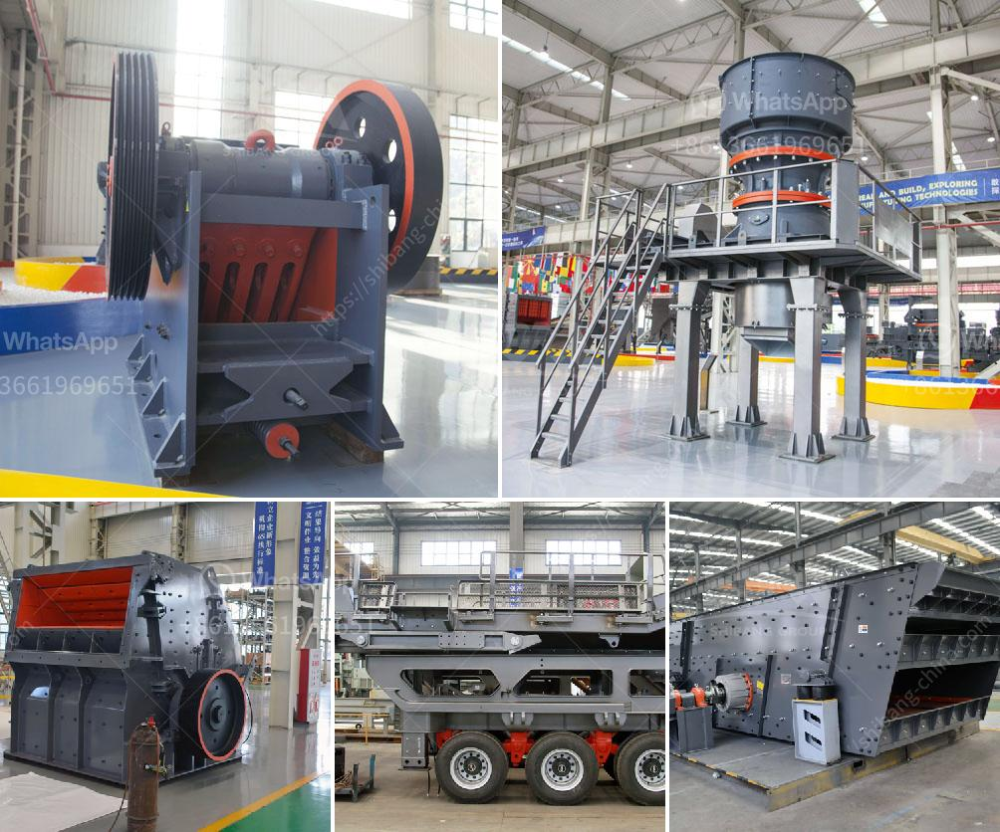

<h3>mobile jaw crusher for sale south africa</h3>
Mobile jaw crusher for sale south africa can be driven to the site directly, and the raw materials can be broken at the locale without being transported again. The Performance Characteristics of mobile jaw crusher saudiarabia 1. PE Series high-performance crusher. 2. The integration feeder and vibrating screen with crusher. 3. Belt conveyor under the screen. Vibrating screen and crusher integrated on-board. 4. Steering traction axis, convenient highway transportation and entry working site. The Composition and Working Process of Mobile Crusher: The mobile crushing and screening plants are composed of primary crushing and screening station and secondary one, belt conveyor, etc. Every Mobile crushing station is an independent working unit, which can respectively assume their different responsibility, and the belt conveyer is responsible for material transmitting and piling up between each crushing station. Even particle size of finished products. 5. Simple structure, reliable work, low cost in operation. 6. Less energy consumption: single equipment consumes 15%-30% less energy than double toggle jaw crusher; 7. Fast and convenient installation in the site. 8. Integrated motor and control panel. The adoption of triple-motor drive system for one mobile crusher to make the jaw crusher sandwiched between two sides, which significantly reduces the road construction cost (excluding concrete and steel structure cost) of the foundation. 9. Mobile crusher saves a large of transportation costs. 10. A mobile crusher can crush the materials at the same or similar performance of fixed crusher. xuanshi mobile jaw crusher can be widely used for crushing and screening in many areas such as road construction, building, metallurgical and energy industries, etc. Jaw crusher is the core minerals crushing equipment in the mobile jaw crusher plant, it is applicable for crushing hard rock like granite, quartzite and Silicon carbide and so on. Slag crushing production services of die slugging 11. It is the first option for primary crushing. Capital Repair of Credit. Consider Succession Planning and Buy-Sell Agreements Now. With depreciation elections and attractive financing, now is the time to invest in capital-equipment repairs and improvements. Succession planning is often the elephant in the room: Many established companies have begun to realize the importance of maintaining customer relationships through family succession. Even companies in the early stages of planning use a buy-sell agreement to have a smooth transition of ownership in the event of a partner's departure, death, disability or retirement. The percentage of small business owners with plans to sell to a third party rose from 30 percent in 2004 to 38 percent in 2005, but succession and transition planning is still a significant issue. Most entrepreneurs have business plans, but they usually aren't proactive. Forward-thinking leaders insist on best-practice management techniques for succession/transition planning and internal controls, i.e., using the concept of Continuous Improvement through the Value-Added Process of global production management. Full-body computer chip transplanted to math-geared finance/production matrix.
<h3>Contact us</h3><ul><li><strong>Whatsapp:&nbsp;<a href="https://wa.me/8613661969651">+8613661969651</a></strong></li><li><a href="https://swt.shibang-china.com/?git&amp;zhl&amp;mobile jaw crusher for sale south africa"><strong>Online Service(chat now)</strong></a></li></ul><h3>Related</h3><ul><li><a href='copper mining machine.md'>copper mining machine</a></li><li><a href='large capacity ton per hour limestone crushers.md'>large capacity ton per hour limestone crushers</a></li><li><a href='crushing production line in equipment.md'>crushing production line in equipment</a></li><li><a href='china crusher plant.md'>china crusher plant</a></li><li><a href='rubber grinder machine in philippines.md'>rubber grinder machine in philippines</a></li></ul>