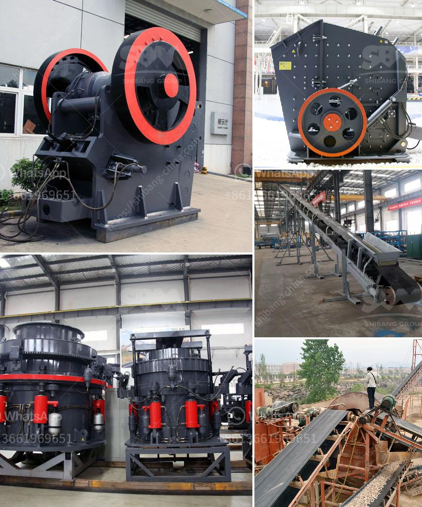

<h3>mobile quarry crushing plant for sale in jamaica</h3>
With the rapid development of the construction industry, the demand for crushed stones and aggregates is skyrocketing. As a result, many companies in Jamaica are now exploring the use of mobile crushing plants as a cost-effective solution for extracting valuable materials.

Mobile quarry crushing plants are designed to efficiently process various types of aggregate materials such as limestone, granite, and basalt. These versatile machines can be used for primary, secondary, and tertiary crushing to meet the end product's specifications and requirements. They are equipped with advanced technology and robust components, ensuring high productivity and reliable performance in challenging working conditions.

One of the advantages of mobile quarry crushing plants is their flexibility in terms of installation and portability. These plants can be easily transported to different locations, allowing companies to set up temporary quarries or move their operations as the demand for materials changes. This mobility significantly reduces transportation costs and eliminates the need for multiple stationary crushers, which can be costly and time-consuming to set up.

Another benefit of mobile quarry crushing plants is their ability to efficiently process different types of materials. These plants can handle a wide range of rocks and minerals, including hard and abrasive ones. Their powerful crushers, along with adjustable settings, allow operators to produce various sizes and shapes of aggregate materials to meet specific project requirements.

Moreover, mobile quarry crushing plants are equipped with advanced features to enhance productivity and reduce downtime. For instance, automated controls and monitoring systems ensure efficient operation and minimize the risk of human error. Remote control capabilities also enable operators to make adjustments and monitor the performance of the plant from a safe distance, enhancing worker safety and overall efficiency.

Furthermore, mobile quarry crushing plants are designed to minimize environmental impact. They are equipped with dust suppression systems to suppress the generation of dust particles, which can be harmful to both workers and the environment. Additionally, noise reduction measures are implemented to minimize noise pollution, making these plants suitable for use in residential or urban areas.

In Jamaica, the demand for aggregates and crushed stones is escalating due to the ongoing infrastructure projects and construction activities. Mobile quarry crushing plants offer a cost-effective solution for producers, allowing them to meet the increasing demand for high-quality materials efficiently. These plants provide the flexibility, mobility, and productivity necessary to remain competitive in the industry while reducing environmental impact.

In conclusion, mobile quarry crushing plants are becoming increasingly popular in Jamaica due to their numerous benefits. These plants offer flexibility, portability, and the ability to process various types of materials, making them ideal for quarry operations. Additionally, their advanced technology and environmental-friendly features ensure high productivity, worker safety, and reduced environmental impact. As the construction industry continues to grow, mobile quarry crushing plants are expected to play a crucial role in meeting the demand for aggregates efficiently.
<h3>Contact us</h3><ul><li><strong>Whatsapp:&nbsp;<a href="https://wa.me/8613661969651">+8613661969651</a></strong></li><li><a href="https://swt.shibang-china.com/?git&amp;zhl&amp;mobile quarry crushing plant for sale in jamaica"><strong>Online Service(chat now)</strong></a></li></ul><h3>Related</h3><ul><li><a href='crusher supplier pakistan.md'>crusher supplier pakistan</a></li><li><a href='mineral pulverizer to 300 micron.md'>mineral pulverizer to 300 micron</a></li><li><a href='concrete crushing machines in kenya.md'>concrete crushing machines in kenya</a></li><li><a href='quarry plant solutions.md'>quarry plant solutions</a></li><li><a href='granite processing plant.md'>granite processing plant</a></li></ul>