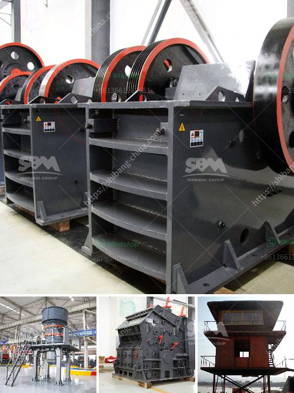

<h3>mobile roller crushers in south africa</h3>
Mobile roller crushers in South Africa are suitable for use in a wide range of applications including mining, quarrying, and recycling. End-product customization is a key feature of these mobile roller crushers, and they can be used independently or as part of a larger crushing operation. Mobile roller crushers have been gaining popularity in recent years due to their many benefits.

One of the main advantages of a mobile roller crusher is its flexibility. These machines are designed to be mobile and can easily be transported from one site to another. This means that they can be moved to wherever they are needed most, increasing efficiency and productivity for mining and construction companies.

Another advantage of mobile roller crushers in South Africa is their capability to crush a wide range of materials. These versatile machines can handle both soft and hard materials efficiently and precisely. These crushers are also known for their ability to break down materials of varying sizes. This versatility makes them highly suitable for various applications, including reducing the size of rocks, ore, and demolition debris.

Additionally, mobile roller crushers are designed for ease of maintenance and operation. Their compact design and user-friendly features make them easy to operate, reducing the need for specialized training. The machines are also equipped with features that simplify maintenance and minimize downtime, ensuring high productivity levels.

South Africa has a wealth of mineral resources, and mining is a key sector in the country's economy. With its extensive mining industry, South Africa faces several challenges when it comes to the efficient processing of minerals and ores. Mobile roller crushers can address such challenges by breaking down materials into smaller sizes, making them easier to handle and process.

Furthermore, mobile roller crushers are environmentally friendly. They are powered by diesel engines, which are more fuel-efficient compared to traditional crushers. This reduced fuel consumption helps to minimize carbon emissions, making them a more sustainable choice for companies focused on reducing their environmental impact.

The demand for mobile roller crushers in South Africa has been growing as more and more industries seek efficient crushing solutions. They offer a cost-effective alternative to traditional crushers, which often require extensive infrastructure and costly installations. Mobile roller crushers can be set up quickly and easily, reducing upfront capital costs and enabling quicker returns on investment.

In conclusion, mobile roller crushers offer numerous benefits for various industries in South Africa. Their flexibility, versatility, ease of maintenance, and environmental friendliness make them an attractive choice for companies seeking efficient and sustainable crushing solutions. As South Africa's mining and quarrying sectors continue to expand, mobile roller crushers will play a crucial role in enabling efficient and sustainable material processing.
<h3>Contact us</h3><ul><li><strong>Whatsapp:&nbsp;<a href="https://wa.me/8613661969651">+8613661969651</a></strong></li><li><a href="https://swt.shibang-china.com/?git&amp;zhl&amp;mobile roller crushers in south africa"><strong>Online Service(chat now)</strong></a></li></ul><h3>Related</h3><ul><li><a href='stone crusher sand block maker.md'>stone crusher sand block maker</a></li><li><a href='cost cement plant manufacturers and cost.md'>cost cement plant manufacturers and cost</a></li><li><a href='hammer mill for sale in dubai.md'>hammer mill for sale in dubai</a></li><li><a href='cara mengelola debu crucher batu bara.md'>cara mengelola debu crucher batu bara</a></li><li><a href='ball mill machine in nigeria.md'>ball mill machine in nigeria</a></li></ul>