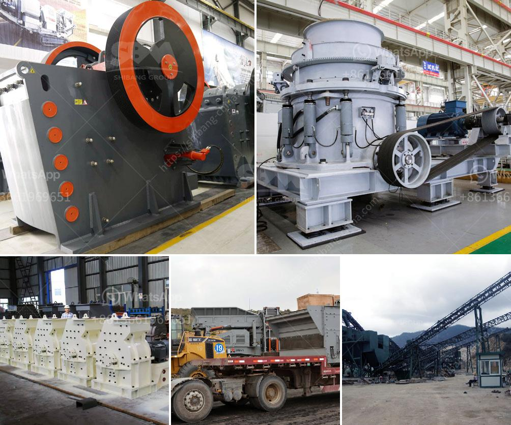

<h3>mobile sand washing machine</h3>
Sand washing is an essential process to remove impurities such as dust, clay, and silt from sand for a variety of applications. Whether you are producing sand for construction, manufacturing, or industrial use, having efficient and reliable equipment is crucial. In this regard, a mobile sand washing machine can be the perfect solution. With its portability and functionality, it provides convenience and flexibility to meet your sand washing needs.

One of the primary advantages of a mobile sand washing machine is its mobility. Unlike traditional stationary machines, a mobile unit can be easily transported to various locations. This proves to be beneficial for industries that require sand washing in different areas. For example, construction companies working on multiple sites or mining operations moving from one deposit to another can effectively use a mobile unit to clean their sand. Additionally, this saves time and cost associated with repeatedly setting up and dismantling a fixed plant.

The functionality of a mobile sand washing machine is another key feature. These machines are equipped with a range of components to ensure efficient sand washing. A typical mobile unit consists of a vibrating feeder, a primary jaw crusher, a belt conveyor, vibrating screen, and a sand washing machine. All these components work together to ensure the removal of impurities, such as dust, clay, and silt, from the sand. The vibrating feeder feeds the sand into the primary jaw crusher for preliminary crushing. The crushed material then passes through the belt conveyor and is further screened by the vibrating screen to remove oversized particles. Finally, the sand is washed in the sand washing machine, which cleanses it thoroughly before it is ready for use.

Not only does a mobile sand washing machine offer mobility and functionality, but it also provides high efficiency. These machines are designed to maximize the washing and cleaning process. Advanced technology and innovative design features guarantee excellent performance. The sand washing machine uses a combination of water, sand, and detergent to remove impurities effectively. With adjustable settings, you can customize the washing process according to your specific requirements. This ensures high-quality clean sand, ready to be used in your desired application.

Furthermore, a mobile sand washing machine is designed with user convenience in mind. Easy operation and maintenance make it user-friendly. The machine's compact size and integrated components simplify the setup and operation process. Additionally, the machine is equipped with safety features to ensure safe operation.

With the increasing demand for clean sand in various industries, having a mobile sand washing machine is a wise investment. Its portability, functionality, efficiency, and user convenience make it an ideal choice for any sand washing application. Whether you are in construction, manufacturing, or mining, a mobile unit will cater to your sand washing needs effectively. Say goodbye to impurities and hello to clean sand with a mobile sand washing machine.
<h3>Contact us</h3><ul><li><strong>Whatsapp:&nbsp;<a href="https://wa.me/8613661969651">+8613661969651</a></strong></li><li><a href="https://swt.shibang-china.com/?git&amp;zhl&amp;mobile sand washing machine"><strong>Online Service(chat now)</strong></a></li></ul><h3>Related</h3><ul><li><a href='mill grinder for sale.md'>mill grinder for sale</a></li><li><a href='crusher in argentina stone crusher.md'>crusher in argentina stone crusher</a></li><li><a href='raymond mill manufactrer in udaipur.md'>raymond mill manufactrer in udaipur</a></li><li><a href='calcium carbonate powder making.md'>calcium carbonate powder making</a></li><li><a href='roller crusher brick making machine.md'>roller crusher brick making machine</a></li></ul>