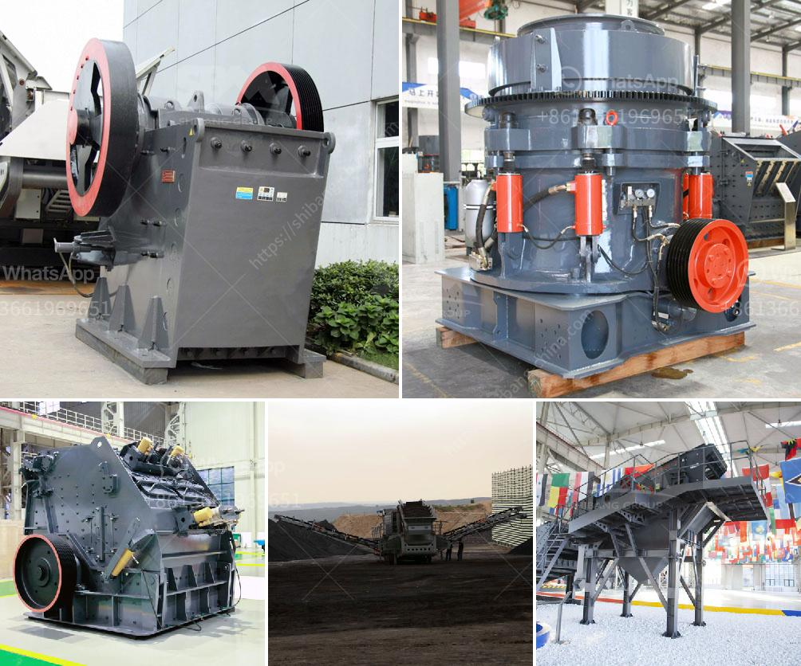

<h3>mobile stone crusher from taiwan</h3>
Mobile Stone Crusher from Taiwan is a crucial equipment for grinding mining ore into fine products. This machine adopts advanced technology and high-efficiency concept, making it an excellent crushing device for various materials. Mobile Stone Crusher from Taiwan is especially designed for various working conditions, such as road construction and environmental engineering.

The stone crusher is heavy-duty machinery that works tirelessly to break down huge rocks into smaller stones or pebbles. It generally uses a hydraulic vibrating feeder, jaw crusher, impact crusher, vibrating screen, and belt conveyor. Different configurations can be customized depending on the customer's requirements.

One of the key advantages of Mobile Stone Crusher from Taiwan is its mobility. It can be easily transported to different construction sites or mining areas, providing maximum flexibility and convenience. This eliminates the need for multiple fixed crushers, reducing infrastructure costs and saving time.

Mobile Stone Crusher from Taiwan not only crushes materials efficiently but also has several environmental benefits. It reduces dust and noise pollution compared to traditional crushing methods. Additionally, it operates with low emissions, making it environmentally friendly. This is crucial for companies adhering to strict environmental regulations and aiming for sustainable practices.

The machine is user-friendly and requires minimal training to operate. Its compact design and easy-to-use controls make it suitable for both skilled and inexperienced operators. The maintenance and servicing requirements are also minimal, making it a cost-effective investment for businesses.

Mobile Stone Crusher from Taiwan is widely used in the mining industry, metallurgical industry, building material industry, and construction waste recycling industry. Its operation principle is that the materials enter the crushing chamber from the feeding chute and are crushed by the impact, shear, friction, and extrusion of the rotating hammer head, hammer plate, and stone. After being crushed, the materials are discharged through the lower grate plate at the bottom of the machine.

Different models of Mobile Stone Crusher from Taiwan are available to suit various needs. They vary in size, production capacity, and power consumption. Some models are designed for crushing hard materials, while others are best suited for softer materials. It is essential to choose the right model based on the specific needs of the project.

In conclusion, Mobile Stone Crusher from Taiwan is an advanced and efficient crushing machine. It offers several advantages, including mobility, cost-effectiveness, environmental friendliness, and ease of operation and maintenance. Whether used in mining, construction, or recycling applications, this equipment delivers excellent performance and contributes to the success of various industries.
<h3>Contact us</h3><ul><li><strong>Whatsapp:&nbsp;<a href="https://wa.me/8613661969651">+8613661969651</a></strong></li><li><a href="https://swt.shibang-china.com/?git&amp;zhl&amp;mobile stone crusher from taiwan"><strong>Online Service(chat now)</strong></a></li></ul><h3>Related</h3><ul><li><a href='coal processing plants for sale.md'>coal processing plants for sale</a></li><li><a href='calcite mining equipment.md'>calcite mining equipment</a></li><li><a href='iron processing plant for sale.md'>iron processing plant for sale</a></li><li><a href='ball mill machine in pakistan.md'>ball mill machine in pakistan</a></li><li><a href='crusher 50 ton per hour price.md'>crusher 50 ton per hour price</a></li></ul>