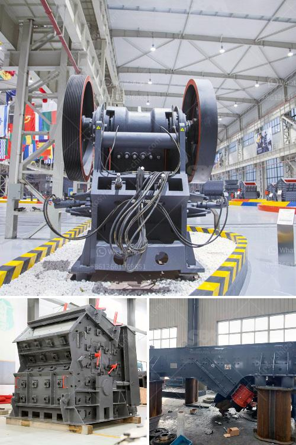

<h3>mobile stone crusher in germany</h3>
Mobile stone crusher in Germany is widely used for medium crushing various ores and bulk materials in mining, smelting, building materials, highway, railway, water, chemical industry and other industries. The crushed materials are of a compressive strength less than 320MPa.

Jaw crusher is widely used in the world market mining industry nowadays, for primary crushing of hard rocks and block materials. The large and medium-size crushers are the key products of our company and stand in the front of the industry in the aspect of design and production.

1. Application: It is widely applied to crush high hardness, mid hardness and soft rocks and ores such as slag, construction materials, marble, etc.

3. PE series jaw crusher is usually used as primary crusher in quarry production lines, mineral ore crushing plants and powder making plants. It can be described as obbligato machine in mining, building construction, construction wastes crushing, Hydropower and Water Resource, railway and highway construction and some other industries.

5. Energy saving: Single machine saves 15%~30% energy, saving double machine saves 30%~60%, and system energy saving more than twice.

The mobile stone crusher in Germany can be equipped with jaw crusher, impact crusher, cone crusher, vibrating screen and belt conveyor. It can be applied in the demolition and recycling industry. For construction waste, it is better to use mobile crusher to process hard and fragile materials.

German mobile crusher is used in vanadium-titanium magnetite ore beneficiation, mining and crushing industry for many years. In addition, Germany’s mining crusher industry develops rapidly, and the market environment is superior with a steady growth rate of over 3%. Therefore, it is a good choice for investment in mining industry.

In conclusion, the mobile stone crusher in Germany is suitable for applications that require high mobility and flexibility. The equipment can be transported over long distances, enabling flexibility and convenience. It can also be stationed at a construction site, which greatly reduces material transportation costs. Whether it is in the construction industry, mining, metallurgy, or other industries, the mobile crusher has become the ideal crushing equipment.
<h3>Contact us</h3><ul><li><strong>Whatsapp:&nbsp;<a href="https://wa.me/8613661969651">+8613661969651</a></strong></li><li><a href="https://swt.shibang-china.com/?git&amp;zhl&amp;mobile stone crusher in germany"><strong>Online Service(chat now)</strong></a></li></ul><h3>Related</h3><ul><li><a href='clay crusher machine.md'>clay crusher machine</a></li><li><a href='price of a rock crusher.md'>price of a rock crusher</a></li><li><a href='jaw crusher prices saudi.md'>jaw crusher prices saudi</a></li><li><a href='gypsum powder making.md'>gypsum powder making</a></li><li><a href='clinker powder machine.md'>clinker powder machine</a></li></ul>