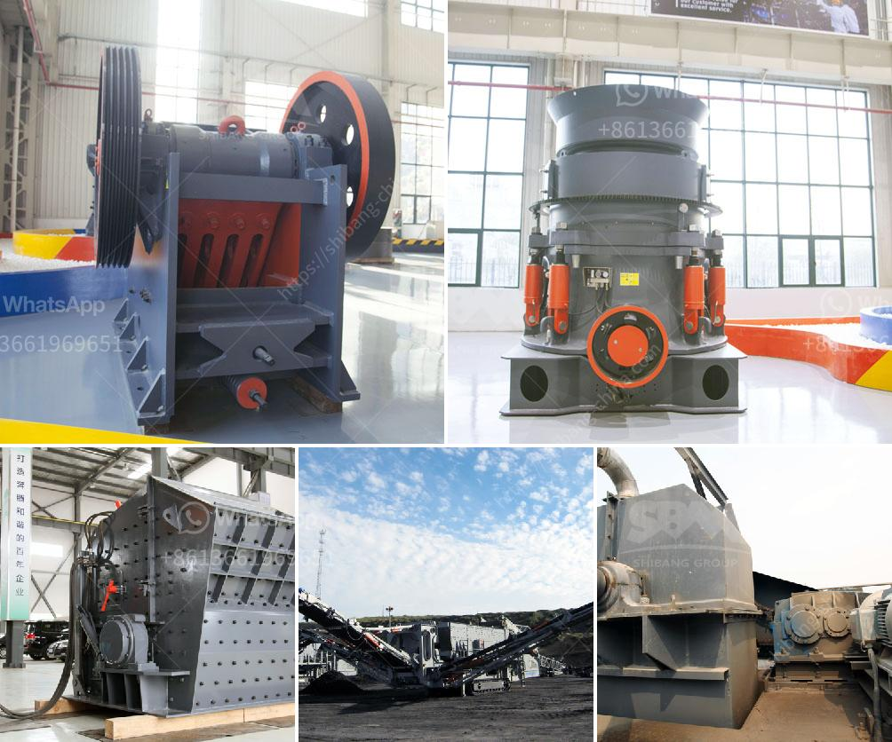

<h3>mobile stone crusher plant on hire in india</h3>
In recent years, India has witnessed a steady growth in the infrastructure sector, with more and more people investing in various construction projects. The government has also taken several initiatives to boost this sector, making it one of the fastest-growing markets in the world. With the rising demand for construction materials, the need for mobile stone crusher plants is also increasing.

A mobile stone crusher plant is a valuable machine for construction mining businesses. It provides new business opportunities and reduces transportation costs. The mobile plant is designed to crush stones on site, which means you can transport the machine to the construction site where the stones need to be crushed. This eliminates the need for extra transportation costs or logistical issues. As a result, the crushing plant can be installed at any location, even beyond the reach of the construction site, provided it meets the required conditions.

One of the advantages of a mobile stone crusher plant is that it can be easily set up and dismantled, which offers the flexibility to relocate it as and when required. This allows for convenient shifting from one project site to another without any hassle. Additionally, these plants are highly efficient and cost-effective, as they can process various materials, including construction waste, concrete, and bricks, providing a high-quality aggregate material for construction.

When it comes to hiring a mobile stone crusher plant, it is essential to consider several factors. Firstly, check the track record of the company that is providing the service. It is important to choose a reliable and reputed company with expertise in the field to ensure quality and timely delivery of services.

Secondly, consider the size and capacity of the stone crusher plant based on your specific requirements. The capacity should be matched with the project scale to ensure that the plant can handle the workload efficiently. Also, consider the type of stones you need to crush and the required output size. A professional company will guide you in selecting the right plant for your needs.

Moreover, it is important to check whether the mobile stone crusher plant complies with the relevant safety standards and regulations. The company should provide proper training to the personnel operating the plant and ensure all safety measures are in place.

Lastly, consider the cost and payment terms. It is recommended to compare quotes from different companies to get the best deal. Ensure that there are no hidden costs and that the payment terms are fair and transparent.

In conclusion, a mobile stone crusher plant on hire in India can provide a valuable solution for construction waste and solid waste management. It can crush various stones to produce a high-quality aggregate material for use in various construction projects. When hiring a mobile stone crusher plant, it is crucial to choose a reliable and experienced company that meets all safety and quality standards. With the right plant and equipment, construction projects in India can be completed efficiently and cost-effectively.
<h3>Contact us</h3><ul><li><strong>Whatsapp:&nbsp;<a href="https://wa.me/8613661969651">+8613661969651</a></strong></li><li><a href="https://swt.shibang-china.com/?git&amp;zhl&amp;mobile stone crusher plant on hire in india"><strong>Online Service(chat now)</strong></a></li></ul><h3>Related</h3><ul><li><a href='barite powder processing plant process flow diagram.md'>barite powder processing plant process flow diagram</a></li><li><a href='how to grind mica for powder in small scale.md'>how to grind mica for powder in small scale</a></li><li><a href='crusher machine sri lanka.md'>crusher machine sri lanka</a></li><li><a href='suppliers of crusher equipment in south africa.md'>suppliers of crusher equipment in south africa</a></li><li><a href='ball mill in peru.md'>ball mill in peru</a></li></ul>