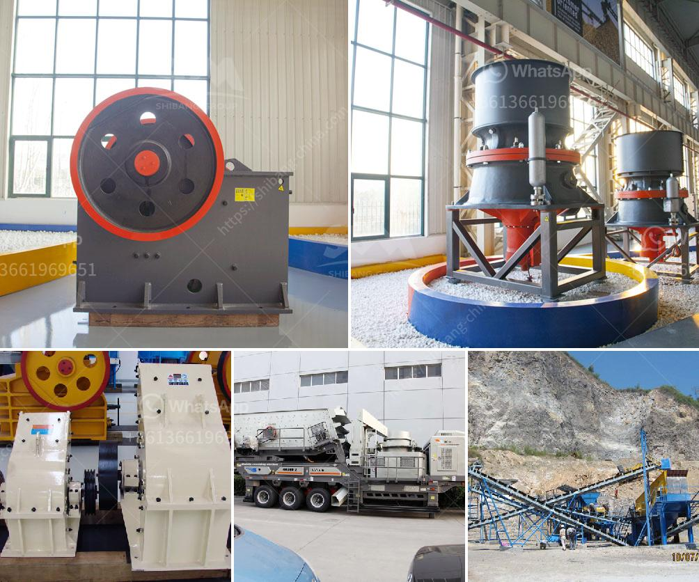

<h3>mobile stone crusher price in india</h3>
Mobile stone crusher has become popular in recent years and it is one of the leading products of modern mining machinery. As a professional mobile stone crusher manufacturer, Zenith has been offering premium quality products and services to our clients for years. Our mobile stone crusher can crush concrete, coal, rock, limestone, granite, aggregate, gravel, basalt, quartz, iron ore, gold ore, and other kinds of stones.

In order to make the mobile stone crusher machine more and more affordable, Zenith has made a new breakthrough in the field of stone crushing plant. Our mobile stone crusher machine price is acceptable and competitive. Here are some unique features of the equipment.

Crusher automation, onboard is an easy-to-use, data-rich system that provides actionable information about the operating modes, maintenance needs, and the overall performance of the machine. You can be sure that the crusher is working efficiently and it is reducing the amount of time and energy needed for crushing operations.

In the stone crushing plant, the higher frequency of use means the equipment needs to be repaired and maintained frequently. Our mobile stone crusher machine can help you save money and time thanks to the extended service life and better operation rate.

As a mobile stone crusher machine supplier in India, Zenith can provide the advanced machines for sale with reasonable price. The mobile stone crusher machine can be moved according to the actual production site and convenient to use. It can save the transportation costs of materials easily and realize the "stone crusher stone crusher" mode of operation.

In the urban road construction, the demolition of the old building is the most headache of the road engineering team. For this reason, we have developed and produced a series of stone crushers that can be used for this purpose. The mobile stone crusher is one of them. Mobile stone crusher can meet the requirements of users, and greatly reduces the cost of production.

Our mobile stone crusher machine price is economic and competitive. If you are interested in our products, we will give you the most preferential prices. Our professional engineers and sales team provide you with prompt and efficient service. You can call us or chat online anytime. Our 24/7 online services ensure that your production tasks will be completed smoothly and successfully.

In conclusion, the mobile stone crusher price in India depends on the type of equipment, different types of equipment have different capacities. Zenith can offer small or large jaw crusher for sale used for ballast crushing and screening plant. If you want to know the stone crusher price or have any questions about stone crusher, please do not hesitate to contact us.
<h3>Contact us</h3><ul><li><strong>Whatsapp:&nbsp;<a href="https://wa.me/8613661969651">+8613661969651</a></strong></li><li><a href="https://swt.shibang-china.com/?git&amp;zhl&amp;mobile stone crusher price in india"><strong>Online Service(chat now)</strong></a></li></ul><h3>Related</h3><ul><li><a href='iron ore crusher in pakistan.md'>iron ore crusher in pakistan</a></li><li><a href='brand new stone crusher for sale in the philippines.md'>brand new stone crusher for sale in the philippines</a></li><li><a href='hammer mills for bricks and blocks.md'>hammer mills for bricks and blocks</a></li><li><a href='quote for sand making machine.md'>quote for sand making machine</a></li><li><a href='stone crusher machine china.md'>stone crusher machine china</a></li></ul>