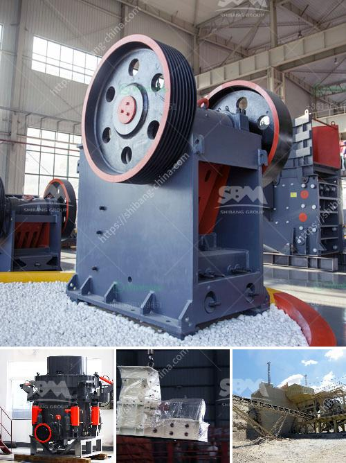

<h3>mobile stone crusher price south africa for cement in usa</h3>
South Africa is rich in abundant mineral resources, especially in the field of construction and cement. Mobile stone crushers are widely used in the construction industry for crushing limestone, granite, basalt, andesite, etc., ore tailings, stone chips, and other hard materials in the production of cement.

Cement production is a complex process. It requires various types of equipment for the production of raw materials, such as crushers, pulverizers, mixers, conveyors, etc. In the cement industry, limestone, slag, pozzolan, and clinker are the main raw materials for manufacturing cement. These materials are crushed into small particles by mobile stone crushers, which simplifies the process of raw material preparation in the cement production line.

As a professional manufacturer and supplier of mobile stone crushers, Hongxing Machinery has higher advanced building materials equipment. We specialize in producing all kinds of mobile crushers for more than 30 years. With the continuous development and progress of science and technology, Hongxing Machinery keeps innovating and improving its products to meet the market demand.

The price of mobile stone crushers differs greatly depending on the type, brand, and performance. A customized mobile stone crusher is also available to meet the specific requirements of customers. In general, the price of mobile stone crushers is relatively low in South Africa, because the price of raw materials is lower and the labor cost is less.

Therefore, the price of mobile stone crushers in South Africa is relatively favorable. For example, a mobile stone crusher with a production capacity of 100-150 tons per hour is equipped with a vibrating feeder, jaw crusher, vibrating screen, conveyor, and so on. Although it has a small footprint, it has a high output, which greatly meets the user's requirements for production.

There are many factors that affect the price of mobile stone crushers, mainly including the following aspects:

Different crushing equipment has different output, fuel consumption, production capacity, etc. Therefore, the price of different types of mobile crushers on the market is different.

The price of mobile stone crushers in South Africa is affected by various regional factors, such as logistics and transportation costs, natural resources, level of ore mining, etc. The South African economy is relatively stable, the transportation network is well-developed, and the government has increased its investment in infrastructure construction, making the cost of transporting mobile stone crushers relatively low.

The scale of production directly determines the degree of automation and efficiency of equipment. The larger the scale, the higher the equipment costs will be. However, the cost per unit of production will be relatively low, which will reduce the overall price of mobile stone crushers.

Different brands have different market positions and customer recognition. The more influential the brand, the higher the price of the mobile stone crushers.

In summary, the mobile stone crushers' price in South Africa is determined by many factors. The machine performance, quality, production cost, brand influence, and other factors will affect the price of the equipment. Therefore, customers should consider various factors comprehensively when purchasing portable stone crushers for cement in the USA. By considering all these factors, they will obtain more cost-effective equipment, thus maximizing their investment value in the long run.
<h3>Contact us</h3><ul><li><strong>Whatsapp:&nbsp;<a href="https://wa.me/8613661969651">+8613661969651</a></strong></li><li><a href="https://swt.shibang-china.com/?git&amp;zhl&amp;mobile stone crusher price south africa for cement in usa"><strong>Online Service(chat now)</strong></a></li></ul><h3>Related</h3><ul><li><a href='marble crusher manufacturer.md'>marble crusher manufacturer</a></li><li><a href='roller grinder mill manufacturers.md'>roller grinder mill manufacturers</a></li><li><a href='cost of used crusher for granite.md'>cost of used crusher for granite</a></li><li><a href='calcium carbonate powder making.md'>calcium carbonate powder making</a></li><li><a href='jaw crusher in china.md'>jaw crusher in china</a></li></ul>