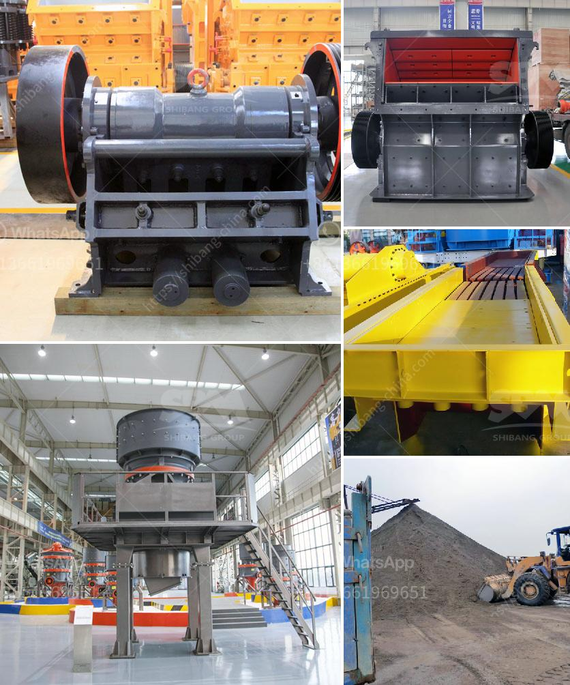

<h3>mobile vibrating screens</h3>
Mobile vibrating screens are an essential component in the construction and mining industries. These screens enable efficient and accurate separation of materials, making them vital for multiple operations. With their compact and versatile design, mobile vibrating screens offer great flexibility and convenience for on-site screening tasks.

One of the key advantages of mobile vibrating screens is their mobility factor. They are specifically designed to be easily transported and set up at various worksites. This ability to be moved quickly makes them particularly useful in construction and mining projects where screeners may need to be relocated frequently. Moreover, their compact design allows for easy transportation on roads and highways, eliminating the need for expensive and time-consuming transportation equipment.

Mobile vibrating screens are equipped with high-quality components, including vibrating motors and efficient screening panels. These vibrating motors generate the required vibrations, allowing the materials to be separated according to size and shape. The screening panels, on the other hand, ensure accurate and precise separation by sieving the materials through various mesh sizes.

The versatility of mobile vibrating screens is another significant advantage. They can efficiently process various materials such as aggregates, sand, and gravel, making them suitable for a wide range of applications. Additionally, different mesh sizes can be easily interchanged, enabling the screen to be adapted to specific sorting requirements.

The efficiency and reliability of mobile vibrating screens contribute significantly to improved productivity on construction and mining sites. Efficient screening ensures that materials of the desired size are obtained, reducing the need for manual sorting afterward. This not only saves time but also reduces labor costs.

In conclusion, mobile vibrating screens are essential equipment for construction and mining projects. Their mobility, compact design, and versatility make them highly advantageous, offering improved productivity and cost savings. These screens are a valuable asset for any company looking to enhance their material sorting and separation processes on-site.
<h3>Contact us</h3><ul><li><strong>Whatsapp:&nbsp;<a href="https://wa.me/8613661969651">+8613661969651</a></strong></li><li><a href="https://swt.shibang-china.com/?git&amp;zhl&amp;mobile vibrating screens"><strong>Online Service(chat now)</strong></a></li></ul><h3>Related</h3><ul><li><a href='granite crusher machine companies.md'>granite crusher machine companies</a></li><li><a href='jaw crusher sale.md'>jaw crusher sale</a></li><li><a href='distributors of conveyor belts in malaysia.md'>distributors of conveyor belts in malaysia</a></li><li><a href='conveyor belt prices malaysia.md'>conveyor belt prices malaysia</a></li><li><a href='iron ore beneficiation plant consultants in india.md'>iron ore beneficiation plant consultants in india</a></li></ul>