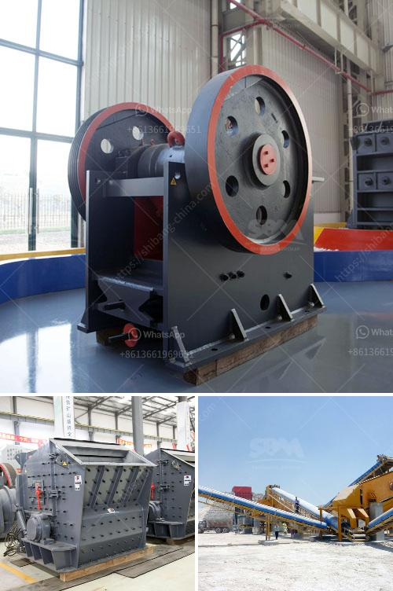

<h3>model of raymound roller mill</h3>
The Raymond roller mill is a popular machine used for industrial applications requiring high throughput rates. The raw materials, such as limestone, gypsum, coal, calcite, barite, and other minerals, are finely ground using this type of mill. The mill is renowned for its excellent grinding efficiency, versatility, and long service life.

One of the key features of the Raymond roller mill is its reliable performance. This mill adopts a vertical structure, which enables it to occupy a small footprint and make full use of the available space. Additionally, the transmission device of the mill is tightly sealed, effectively preventing dust from entering and ensuring a clean working environment.

The main components of the Raymond roller mill include the main machine, the analysis machine, the cyclone separator, the blower, and the jaw crusher. The working process is as follows: the raw material is firstly crushed by the jaw crusher and then enters the grinding chamber of the mill through the vibrating feeder. The materials are evenly and continuously fed into the grinding ring through the feeding hopper, and are grinded by the roller under the action of centrifugal force.

The grinded materials are blown into the cyclone separator by the airflow of the blower, and the heavy particles will fall back onto the grinding chamber for regrinding, while the fine materials will be discharged through the cyclone separator. The airflow returns back to the blower and the whole grinding process repeats.

The Raymond roller mill has numerous advantages over other milling equipment. Firstly, the fineness of the finished powder can be adjusted between 80-400 mesh, which means it can be used for both fine and coarse grinding. Secondly, the grinding ring and roller are made of durable materials, ensuring a long service life and reducing maintenance costs. Thirdly, the whole system operates under negative pressure, reducing dust and ensuring a clean working environment.

In addition to its reliable performance and versatility, the Raymond roller mill also features low energy consumption. The mill adopts advanced technology and is equipped with a powerful blower, which provides strong suction capacity and delivers a large amount of air to the grinding chamber. This ensures efficient grinding and reduces the energy consumption of the mill.

Furthermore, the Raymond roller mill is also equipped with an advanced control system, allowing operators to easily regulate the grinding process and achieve the desired fineness. The mill can be operated automatically, reducing labor costs and improving production efficiency.

Overall, the Raymond roller mill is an excellent milling machine that can be used for various industrial applications. Its reliable performance, versatility, and low energy consumption make it a preferred choice in many industries. With its advanced technology and user-friendly design, this model of the Raymond roller mill is sure to continue providing efficient and reliable grinding solutions for years to come.
<h3>Contact us</h3><ul><li><strong>Whatsapp:&nbsp;<a href="https://wa.me/8613661969651">+8613661969651</a></strong></li><li><a href="https://swt.shibang-china.com/?git&amp;zhl&amp;model of raymound roller mill"><strong>Online Service(chat now)</strong></a></li></ul><h3>Related</h3><ul><li><a href='china crusher contact australia.md'>china crusher contact australia</a></li><li><a href='spec for 200 tph crushing plant.md'>spec for 200 tph crushing plant</a></li><li><a href='looking for small coal processing equipment.md'>looking for small coal processing equipment</a></li><li><a href='conveyor belt price per foot.md'>conveyor belt price per foot</a></li><li><a href='used granite machines for sale cone crusher stone crusher.md'>used granite machines for sale cone crusher stone crusher</a></li></ul>