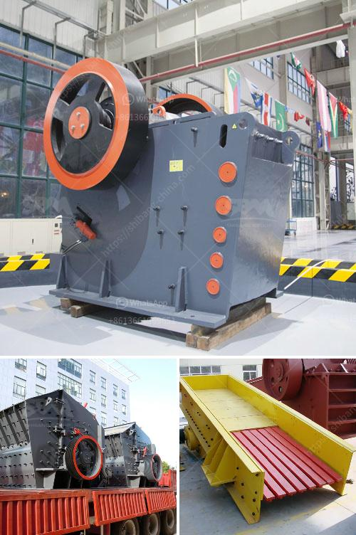

<h3>model project of stone powder</h3>
In our quest for sustainable and eco-friendly solutions, a model project of stone powder has emerged as a promising alternative in the construction industry. Stone powder, which is a waste material derived from quarries or mines, is transformed into a valuable resource with numerous applications in the field of construction.

The concept behind this model project is simple yet effective – the utilization of stone powder as a building material, thereby reducing waste and environmental impact. By harnessing this abundant waste resource, we can reduce the need for traditional construction materials such as sand and gravel, which are often extracted through environmentally damaging processes.

One of the primary benefits of using stone powder in construction is its low carbon footprint. Unlike traditional materials, stone powder does not require extensive energy-intensive processing to be converted into a building material. It is readily available and can be easily incorporated into various construction applications, such as concrete, asphalt, and bricks.

Moreover, stone powder exhibits excellent binding properties, making it an ideal additive in the production of construction materials. When mixed with cement, it enhances the strength and durability of concrete structures, reducing the need for frequent repairs or replacements. This, in turn, reduces maintenance costs and extends the lifespan of buildings, contributing to long-term sustainability.

Additionally, the use of stone powder in construction projects fosters circular economy principles by diverting waste from landfills and reducing the demand for natural resources. Instead of further depleting our environment, this model project promotes the reuse and recycling of materials, aligning with the principles of a more sustainable future.

Alongside its environmental benefits, the model project of stone powder also holds economic advantages. By utilizing this waste material, construction companies can save on material costs, which can then be reinvested in other sustainability initiatives or used to provide affordable housing solutions. This project helps create a win-win situation for both the environment and the construction industry.

In conclusion, the model project of stone powder is a groundbreaking initiative that paves the way for sustainable construction practices. By tapping into this underutilized resource, we can decrease waste generation, reduce carbon emissions, and promote a circular economy. Both economically and environmentally beneficial, this project showcases the potential of innovative thinking in addressing the challenges of our rapidly changing world. It is time for the construction industry to embrace sustainable alternatives such as stone powder and lead the way towards a greener, more sustainable future.
<h3>Contact us</h3><ul><li><strong>Whatsapp:&nbsp;<a href="https://wa.me/8613661969651">+8613661969651</a></strong></li><li><a href="https://swt.shibang-china.com/?git&amp;zhl&amp;model project of stone powder"><strong>Online Service(chat now)</strong></a></li></ul><h3>Related</h3><ul><li><a href='jaw crusher manufacturer in italy.md'>jaw crusher manufacturer in italy</a></li><li><a href='crusher manufactures in europe.md'>crusher manufactures in europe</a></li><li><a href='ore crushers benoni.md'>ore crushers benoni</a></li><li><a href='crushing plant limestone.md'>crushing plant limestone</a></li><li><a href='cocoa processing plant in nigeria.md'>cocoa processing plant in nigeria</a></li></ul>