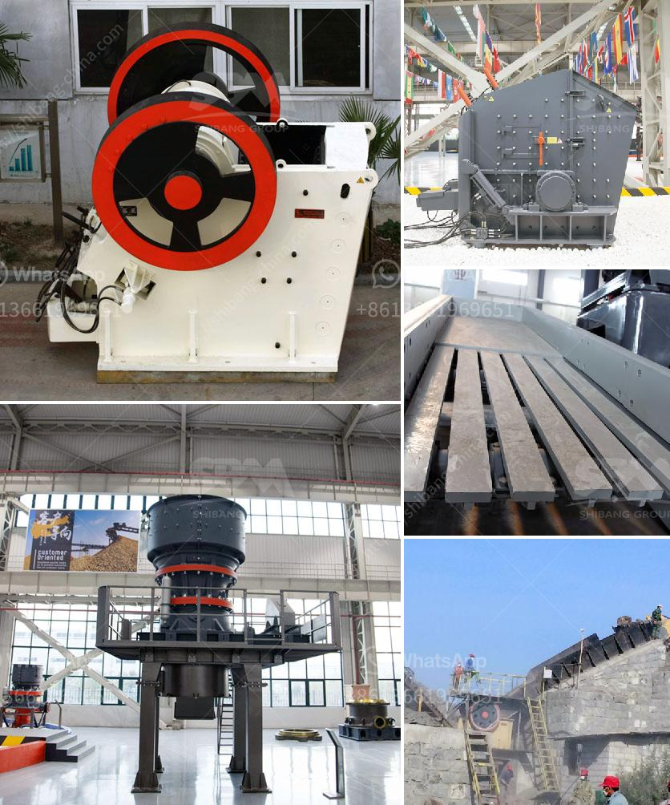

<h3>mtw grinding mill</h3>
In recent years, with the rapid development of the mining industry, grinding equipment has become an essential part. However, with the variety of grinding mills available on the market, how to choose the right grinding equipment has become a headache for investors.

MTW Grinding Mill, a pioneer in the field of grinding equipment, has proven its superior performance in various mineral processing applications. MTW European Type Trapezium Mill, this series of MTW Grinding Mill adopts the latest European grinding technology and philosophy. It boasts strong adaptability to materials and excellent grinding efficiency.

One of the outstanding features of MTW Grinding Mill is its high efficiency and energy-saving. In the process of grinding materials, it can improve the classification accuracy of airflow, ensuring a high powder extraction rate. Moreover, the unique curved blade design of the classifier reduces resistance, resulting in a significant reduction in energy consumption. This feature has made MTW Grinding Mill a popular choice for many mining companies.

Another advantage of MTW Grinding Mill is its automation. Equipped with advanced electric control system, it can realize remote control, monitoring, and automatic management. This greatly improves the stability and reliability of the equipment operation, reducing the labor intensity of operators.

MTW Grinding Mill is also famous for its environmental performance. It effectively reduces dust and noise pollution during the grinding process. The internal sealing system strictly controls the spread of dust, creating a clean working environment. In addition, the equipment is also equipped with a muffler, effectively reducing the noise generated during operation.

The wide range of applications is also a highlight of MTW Grinding Mill. It can be used to grind various non-flammable and non-explosive materials with Mohs hardness below 9.3 and moisture content below 6%. Whether it is limestone, calcite, dolomite, barite, talc, gypsum, or other minerals, MTW Grinding Mill can handle them expertly.

Furthermore, the suitable design and layout of the equipment make maintenance and repair more convenient. The roller sleeve and lining plate can be replaced with the help of an automatic hydraulic device. This not only saves time but also reduces the labor cost for maintenance.

Overall, MTW Grinding Mill is a reliable and efficient mining machinery equipment. It combines advanced grinding technology, excellent performance, and environmental protection features, making it an ideal choice for grinding operations in the mining industry. Whether you are a mining company or an individual investor, MTW Grinding Mill will bring you excellent grinding results and create greater value for you.
<h3>Contact us</h3><ul><li><strong>Whatsapp:&nbsp;<a href="https://wa.me/8613661969651">+8613661969651</a></strong></li><li><a href="https://swt.shibang-china.com/?git&amp;zhl&amp;mtw grinding mill"><strong>Online Service(chat now)</strong></a></li></ul><h3>Related</h3><ul><li><a href='stone grinding plant.md'>stone grinding plant</a></li><li><a href='large capacity ton per hour limestone crushers.md'>large capacity ton per hour limestone crushers</a></li><li><a href='jaw crusher materials.md'>jaw crusher materials</a></li><li><a href='hammer mill in china.md'>hammer mill in china</a></li><li><a href='product of 100 tons mini cement plant.md'>product of 100 tons mini cement plant</a></li></ul>