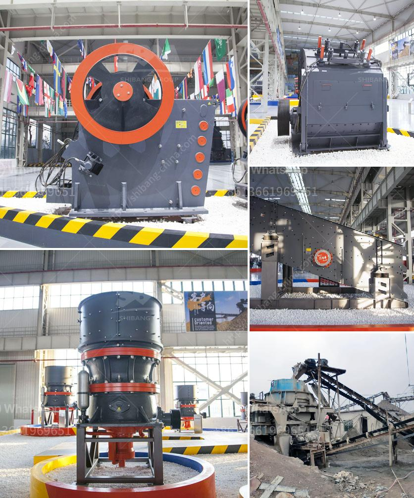

<h3>mtw series trapezium mill</h3>
The MTW series trapezium mill is a milling equipment developed by Zenith, a leading manufacturer and supplier based in China. It is designed to grind various materials, such as limestone, calcite, dolomite, barite, gypsum, talc, calcium carbonate, bentonite, and other minerals, providing high-quality powder for various industries.

One of the key features of the MTW series trapezium mill is its unique trapezoidal face design. This design ensures that the grinding rollers and rings are always in contact with the materials, resulting in efficient grinding and excellent powder production. Additionally, the trapezoidal face design reduces the material's slip velocity, enhancing the grinding efficiency further.

Another advantage of the MTW series trapezium mill is its advanced technology and stable performance. The mill adopts advanced technology from abroad, such as the European version grinding technology, rotation of the transmission part, and overall drive, ensuring stable operation and low maintenance costs. Moreover, the mill has a high degree of automation, which reduces labor costs and improves production efficiency.

The MTW series trapezium mill also offers excellent product size control. It has a wide range of applications, from coarse grinding to fine grinding, enabling it to meet various requirements of different industries. The mill's adjustable and controllable separator speed helps to achieve precise control over the fineness of the final product.

In terms of environmental protection, the MTW series trapezium mill is designed to be environmentally friendly. It adopts the pulse dust collector system, which effectively reduces dust emissions and provides a clean and healthy working environment. The mill also features low noise levels, further enhancing the operator's comfort while working.

Furthermore, the MTW series trapezium mill has a strong adaptability to different materials. It can grind not only hard materials but also materials with a moisture content of up to 8%. This makes it suitable for grinding materials that are easily affected by high temperatures or easily adhere to the grinding roller and ring.

In addition to its excellent performance and features, the MTW series trapezium mill also has a wide range of applications. It is commonly used in industries such as metallurgy, mining, chemical engineering, cement, construction, refractory materials, ceramics, and more. Its versatility makes it a valuable asset for various manufacturing processes and industries.

Overall, the MTW series trapezium mill is an exceptional milling equipment that offers high-quality powder production, stable performance, precise size control, environmental protection, and adaptability to different materials. It is a reliable and efficient choice for industries that require grinding and powder production. With its advanced technology and features, it contributes to the development and progress of various industries worldwide.
<h3>Contact us</h3><ul><li><strong>Whatsapp:&nbsp;<a href="https://wa.me/8613661969651">+8613661969651</a></strong></li><li><a href="https://swt.shibang-china.com/?git&amp;zhl&amp;mtw series trapezium mill"><strong>Online Service(chat now)</strong></a></li></ul><h3>Related</h3><ul><li><a href='thailand coconut processing machine.md'>thailand coconut processing machine</a></li><li><a href='german crushing stone plant.md'>german crushing stone plant</a></li><li><a href='dolomite mining and processing.md'>dolomite mining and processing</a></li><li><a href='rock crushing equipment price.md'>rock crushing equipment price</a></li><li><a href='stone crusher and quarry for sale in pakistan.md'>stone crusher and quarry for sale in pakistan</a></li></ul>