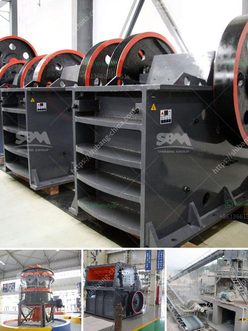

<h3>nigeria inpactor crushers price</h3>
As Nigeria continues to make strides towards diversifying its economy, the mining sector has gained significant attention. One of the integral components in the mining industry is the impact crusher – a powerful tool that efficiently breaks down larger rocks and minerals into smaller, more manageable pieces. In this article, we'll explore the current prices of impact crushers in Nigeria, highlighting their importance and the potential they hold for the nation's mining sector.

Impact crushers are devices used to crush rocks and minerals during the extraction process. They are designed to reduce the size of the materials for easier handling, transportation, and subsequent processing. These crushers operate using the principle of impact, where an external force is applied to cause fragmentation of the raw material.

While the prices of impact crushers in Nigeria may vary depending on the specific model, size, functionality, and brand, they are generally available in a wide price range. On average, a good quality impact crusher costs between ₦2,000,000 and ₦6,000,000.

1. Brand Reputation: Internationally recognized brands tend to be more expensive due to their proven performance, durability, and reliability in the field. However, local manufacturers and suppliers also offer competitive prices, making it worthwhile to consider Nigerian-made options.

2. Features and Capacities: Impact crushers come in various sizes and capacities, ranging from small portable crushers suitable for small-scale operations to large industrial models used in massive mining projects. Higher capacities generally come with a higher price tag.

3. Additional Features: Advanced features such as automated control systems, noise reduction mechanisms, and improved accessibility for maintenance can add to the cost of an impact crusher.

1. Enhanced Efficiency: Impact crushers enable the efficient processing of large rocks and minerals, reducing the time and effort required to extract valuable resources. Their ability to turn oversized materials into smaller chunks makes them highly efficient in primary and secondary crushing processes.

2. Economic Value: The extraction and processing of minerals contribute to Nigeria's economy, providing employment opportunities and boosting revenue generation. Impact crushers play a crucial role in these processes, maximizing production and ensuring cost-effective operations.

3. Safety and Sustainability: Impact crushers are designed with safety in mind, minimizing the risk of accidents and injuries during material processing operations. Additionally, their efficient energy consumption contributes to a more sustainable mining sector by reducing the environmental impact of mining activities.

Impact crushers are vital tools that are revolutionizing Nigeria's mining sector. With their ability to break down larger rocks and minerals into smaller, more manageable sizes, they enhance the efficiency of mining operations and contribute to the country's economic growth. As the demand for high-quality minerals continues to rise, it is crucial for Nigeria to invest in the development of its mining industry while considering the prices and features of impact crushers. By capitalizing on these advanced crushing technologies, Nigeria can unlock its immense mining potential and fulfill its ambition of becoming a major player in the global minerals market.
<h3>Contact us</h3><ul><li><strong>Whatsapp:&nbsp;<a href="https://wa.me/8613661969651">+8613661969651</a></strong></li><li><a href="https://swt.shibang-china.com/?git&amp;zhl&amp;nigeria inpactor crushers price"><strong>Online Service(chat now)</strong></a></li></ul><h3>Related</h3><ul><li><a href='micro powder grinding mill.md'>micro powder grinding mill</a></li><li><a href='crusher impact germany.md'>crusher impact germany</a></li><li><a href='price list coal crusher plant 1500 ton hour.md'>price list coal crusher plant 1500 ton hour</a></li><li><a href='types of limestone screening.md'>types of limestone screening</a></li><li><a href='two roll mill machine.md'>two roll mill machine</a></li></ul>