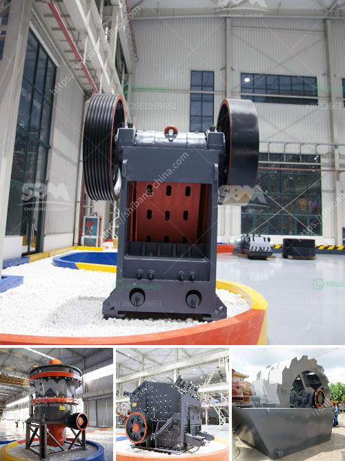

<h3>nigeria minerals processing company</h3>
Nigeria Minerals Processing Company, also known as NIMCO, is a subsidiary of the Nigeria Mining Corporation which was established in 1973. NIMCO is responsible for the processing of solid minerals in Nigeria. The company has its head office in Jos, Plateau State and operates in various locations across the country.

NIMCO plays a crucial role in the mining sector of Nigeria by processing raw minerals into finished products. The company specializes in the processing of minerals such as tantalite, columbite, barite, bauxite, zinc ore, copper, tin, iron ore, lead, and gold. These minerals are processed into various grades and used for diverse purposes.

Nigeria is blessed with abundant mineral resources, and NIMCO has been at the forefront of harnessing these resources for economic development. The company ensures that the minerals are processed and refined to meet international standards. This has made Nigeria a major exporter of processed minerals, contributing significantly to the country's revenue.

Furthermore, NIMCO prioritizes sustainable mining practices and employs modern techniques to minimize the environmental impact of mineral processing. The company invests in advanced technology and machinery to ensure efficient operations and minimize waste. This commitment to sustainable practices has positioned Nigeria Minerals Processing Company as a responsible player in the mining industry.

NIMCO also contributes to job creation and economic empowerment in Nigeria. The company provides employment opportunities to a significant number of individuals, both directly and indirectly. Through its operations, NIMCO supports local communities and contributes to their socio-economic development.

In conclusion, Nigeria Minerals Processing Company is an essential player in the mining sector of Nigeria. Through its expertise in mineral processing and commitment to sustainable practices, the company contributes to economic development and job creation. NIMCO's role in harnessing Nigeria's mineral resources positions the country as a key player in the global mineral market.
<h3>Contact us</h3><ul><li><strong>Whatsapp:&nbsp;<a href="https://wa.me/8613661969651">+8613661969651</a></strong></li><li><a href="https://swt.shibang-china.com/?git&amp;zhl&amp;nigeria minerals processing company"><strong>Online Service(chat now)</strong></a></li></ul><h3>Related</h3><ul><li><a href='hammer grinder mill.md'>hammer grinder mill</a></li><li><a href='conveyor belts bogota.md'>conveyor belts bogota</a></li><li><a href='how to grind mica for powder in small scale.md'>how to grind mica for powder in small scale</a></li><li><a href='coal beneficiation.md'>coal beneficiation</a></li><li><a href='fairly used quarry crusher in nigeria price.md'>fairly used quarry crusher in nigeria price</a></li></ul>