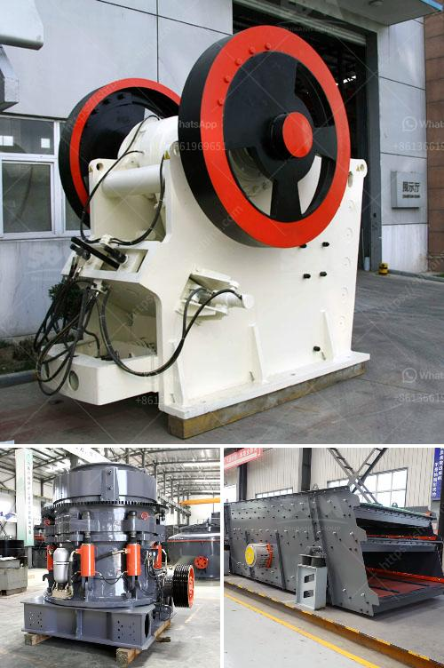

<h3>non magnetic vibrating screen</h3>
In various industries, screening processes play a vital role in separating and sorting different materials for further processing. Traditionally, magnetic screens have been used to remove ferrous contaminants from the feed materials. However, in certain applications where magnetic separation is not required, non-magnetic vibrating screens have proven to be a more efficient and cost-effective solution.

Non-magnetic vibrating screens utilize vibration to separate and classify materials based on their particle size. These screens consist of a mesh screen with vibrating panels that generate the vibration necessary for the separation process. Unlike magnetic screens, non-magnetic vibrating screens do not rely on magnets to remove unwanted materials, making them suitable for a wide range of applications.

One significant advantage of non-magnetic vibrating screens is their ability to handle both wet and dry materials effectively. Wet materials that tend to stick or clog magnetic screens can easily pass through the mesh of a non-magnetic vibrating screen. This prevents any material buildup, ensuring seamless and continuous operation. Additionally, these screens are highly efficient in handling dry materials, providing a consistent particle size distribution for precise separation.

The non-magnetic nature of these screens also eliminates the risk of magnetic interference in certain industries. In applications such as food processing or pharmaceutical manufacturing, where the presence of magnetic particles could contaminate the final product or affect its quality, non-magnetic vibrating screens offer a reliable solution. By effectively removing unwanted contaminants without magnetism, these screens ensure the integrity of the end product.

Another key advantage of non-magnetic vibrating screens is their versatility and adaptability to different industries. These screens can be customized to meet specific requirements, including different mesh sizes, screen panel shapes, and screen deck configurations. This flexibility allows for the efficient separation of a wide range of materials, including minerals, aggregates, chemicals, and more.

In terms of maintenance, non-magnetic vibrating screens are relatively easy to clean and maintain. They do not require frequent magnetic inspections or cleaning processes, reducing downtime and improving overall operational efficiency. Additionally, most non-magnetic screens are designed with self-cleaning mechanisms, further minimizing the need for manual cleaning and increasing productivity.

Overall, non-magnetic vibrating screens offer several advantages over traditional magnetic screens. Their ability to handle both wet and dry materials effectively, while eliminating the risk of magnetic interference, makes them an ideal choice for various industries. Furthermore, their versatility, adaptability, and low maintenance requirements ensure maximum productivity and efficiency.

As technology continues to advance, the development of non-magnetic vibrating screens with improved features and capabilities is expected. From increased energy efficiency to enhanced screening accuracy, manufacturers are constantly working to optimize these screens and provide an even more reliable solution for material separation and classification.

In conclusion, non-magnetic vibrating screens have proven to be a valuable alternative to magnetic screens in various industries. Their efficient and versatile nature, combined with low maintenance requirements and the ability to handle both wet and dry materials, make them an ideal choice for any screening application. As the demands for precise separation processes continue to grow, non-magnetic vibrating screens will undoubtedly continue to evolve, driving efficiency and productivity across industries.
<h3>Contact us</h3><ul><li><strong>Whatsapp:&nbsp;<a href="https://wa.me/8613661969651">+8613661969651</a></strong></li><li><a href="https://swt.shibang-china.com/?git&amp;zhl&amp;non magnetic vibrating screen"><strong>Online Service(chat now)</strong></a></li></ul><h3>Related</h3><ul><li><a href='mining equipment chrome concentrates in turkey.md'>mining equipment chrome concentrates in turkey</a></li><li><a href='stone crusher manufacturers in dhansura.md'>stone crusher manufacturers in dhansura</a></li><li><a href='crusher in argentina stone crusher.md'>crusher in argentina stone crusher</a></li><li><a href='marble mining equipment manufacturers.md'>marble mining equipment manufacturers</a></li><li><a href='used aggregate crusher for sale in india.md'>used aggregate crusher for sale in india</a></li></ul>