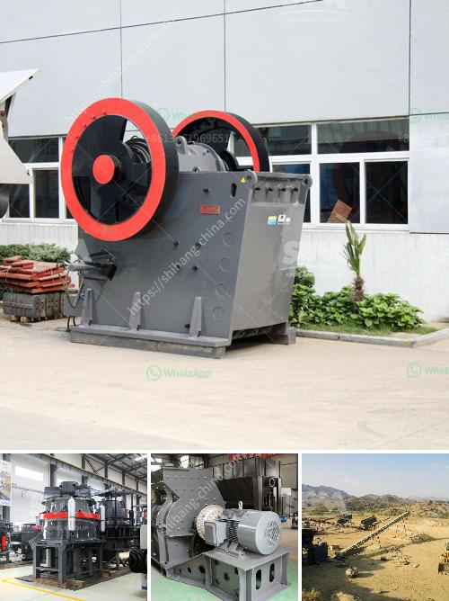

<h3>old impact crushing plant for sale</h3>
If you are in the market for a reliable and efficient crushing plant for your mining or construction needs, consider purchasing an old impact crushing plant. While it may be second-hand, these plants pack a powerful punch and can still offer years of reliable service.

Impact crushing plants are designed to crush rocks and other materials to a specific size for further processing. They employ a heavy-duty rotor that rotates at high speeds, allowing the material to be shattered upon impact. This not only reduces the size of the material but also creates a more uniform shape, making it easier to handle and process.

While new impact crushing plants can be costly, opting for an old one can save you a significant amount of money. These older models are often available at a fraction of the cost of newer options, allowing you to maximize your budget without compromising on quality. Plus, many old impact crushing plants are made by reputable manufacturers known for their durable and long-lasting equipment.

Before purchasing an old impact crushing plant, it is essential to thoroughly inspect it and ensure that it meets your specific requirements. Check for any signs of wear and tear, including worn-out parts or damaged components. Additionally, inquire about the plant's history, including any previous repairs or maintenance performed.

While old impact crushing plants may not offer the latest technological advancements, they can still provide excellent performance. They are ideal for smaller mining or construction operations that do not require the latest features but demand a reliable solution.

In conclusion, an old impact crushing plant is a cost-effective option for those seeking a reliable and efficient solution for their crushing needs. With proper inspection and maintenance, these plants can still deliver the performance you require at a fraction of the cost. So, consider exploring the market for an old impact crushing plant and reap the benefits it has to offer.
<h3>Contact us</h3><ul><li><strong>Whatsapp:&nbsp;<a href="https://wa.me/8613661969651">+8613661969651</a></strong></li><li><a href="https://swt.shibang-china.com/?git&amp;zhl&amp;old impact crushing plant for sale"><strong>Online Service(chat now)</strong></a></li></ul><h3>Related</h3><ul><li><a href='european stone crusher.md'>european stone crusher</a></li><li><a href='used carbon grinding production line.md'>used carbon grinding production line</a></li><li><a href='limestone powder mill.md'>limestone powder mill</a></li><li><a href='gypsum furnace for boiling.md'>gypsum furnace for boiling</a></li><li><a href='100tph coal crushing process.md'>100tph coal crushing process</a></li></ul>