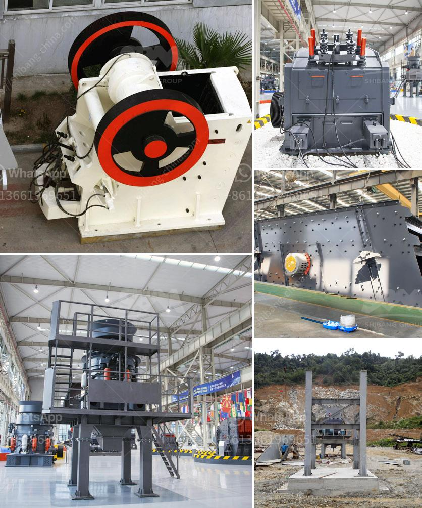

<h3>on sale used quarry machinery uk</h3>
Quarrying has been an essential part of the construction industry for centuries. It involves the extraction of natural resources such as limestone, granite, and sandstone from the earth's crust to produce construction materials like aggregates, cement, and asphalt. To carry out these operations efficiently, the use of heavy machinery is imperative. However, the high cost of brand-new equipment can often be a barrier for smaller businesses or those operating on a tight budget.

Fortunately, there is an alternative solution in the form of used quarry machinery. The United Kingdom is home to a diverse range of quarrying activities, and as a result, there is a well-established market for second-hand equipment. Purchasing used machinery can be a cost-effective way for both established quarries and new businesses to expand their operations without breaking the bank.

One of the key advantages of buying used quarry machinery in the UK is the potential for significant cost savings. As with any used product, pre-owned machinery tends to be available at a fraction of the price of new equipment. This cost differential allows businesses to acquire high-quality machinery that might otherwise be financially out of reach.

Moreover, used quarry machinery often retains a good level of productivity and reliability. Quarry equipment is built to withstand tough conditions and heavy workloads, meaning that even machinery that has been previously used can still offer excellent performance. On top of that, the industry has a strong tradition of maintenance and refurbishment, ensuring that second-hand machines can be fully overhauled to meet the required standards.

Another benefit of purchasing used quarry machinery in the UK is the wider selection available. With the country's long history of quarrying, there is a vast inventory of used equipment, ranging from excavators and loaders to crushers and screening plants. This wide range of choices allows businesses to find the most suitable machinery for their specific needs, ensuring optimal efficiency and productivity.

When considering the purchase of used quarry machinery, it is important to take certain factors into account. Firstly, conducting thorough research on the specific equipment and its condition is crucial. Inspecting machinery before making a purchase can help identify any potential issues and assess the overall quality of the equipment.

Additionally, working with reputable dealers or sellers is essential to ensure a smooth and successful buying process. Established vendors will have a wealth of knowledge about the equipment they are selling and can provide valuable insights and recommendations. Furthermore, they may offer warranties or after-sale support, which can help mitigate potential risks associated with buying used machinery.

In conclusion, buying used quarry machinery in the UK presents a viable solution for quarrying businesses looking to expand their operations cost-effectively. The availability of pre-owned equipment at significantly lower prices, coupled with the durability and performance of quarry machinery, makes it an attractive option for companies of all sizes. By conducting thorough research and collaborating with reputable sellers, businesses can acquire high-quality machinery that meets their specific requirements, ensuring efficiency and productivity in their quarrying operations.
<h3>Contact us</h3><ul><li><strong>Whatsapp:&nbsp;<a href="https://wa.me/8613661969651">+8613661969651</a></strong></li><li><a href="https://swt.shibang-china.com/?git&amp;zhl&amp;on sale used quarry machinery uk"><strong>Online Service(chat now)</strong></a></li></ul><h3>Related</h3><ul><li><a href='list of crusher industry in nepal.md'>list of crusher industry in nepal</a></li><li><a href='manganese limestone processing unit.md'>manganese limestone processing unit</a></li><li><a href='mobile stone crusher in germany.md'>mobile stone crusher in germany</a></li><li><a href='hammer mill 50 hr.md'>hammer mill 50 hr</a></li><li><a href='price of industrial crusher in nigeria.md'>price of industrial crusher in nigeria</a></li></ul>