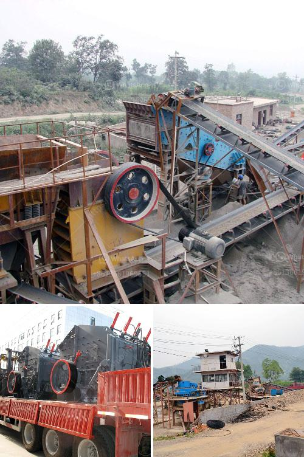

<h3>operating a granite quarry crusher in nigeria</h3>
Nigeria is abundant with granite rock residue that was formed millions of years ago, as a result of the cooling and solidification of lava from volcanic eruptions. Granite is a much sought-after stone for use in construction projects because of its strength and durability. The crushing process of granite involves several stages such as blasting, primary crushing, secondary crushing, fine crushing, screening, and grading. In Nigeria, the quarrying and granite crushing process play a vital role in the efficient operation of the quarry and the processing of granite.

The quarry processes the rock into granite crushed stone (gravel) aggregate, including coarse aggregate, fine aggregate, and sand. The size of crushed granite varies depending on the quarry where it was crushed. Some quarries may produce larger-sized stones, while others produce smaller-sized stones for specific purposes.

The primary crushing stage involves the use of a jaw crusher or sometimes a gyratory crusher. Oversized rocks that cannot pass through the jaw crusher are sent back to the secondary crusher for further crushing. The maximum size of the primary crusher varies depending on the capacity of the quarry and the properties of the granite rock.

The secondary crushing stage involves the use of cone crushers or impact crushers. Cone crushers are commonly used in medium to hard materials, while impact crushers are commonly used for softer materials. Both types of crushers are efficient in crushing granite rocks into small particles.

After the secondary crushing stage, the granite rocks need to be further crushed into even smaller sizes for specific applications. Fine crushing is usually achieved using tertiary crushers, which include cone crushers, vertical shaft impact crushers (VSI), or high-pressure grinding rolls (HPGR). The crushed granite is then screened to separate different sizes of aggregate.

The final stage in the granite crushing process is grading and sorting the crushed granite based on size and quality. Grading is performed using vibrating screens with different mesh sizes, which allow for the separation of fine particles from coarse particles. The sorted aggregates are then transported to the storage or stockpile areas for later use in various construction projects.

Operating a granite quarry crusher in Nigeria requires diligent planning and foresight to ensure efficient operation and optimum productivity. The investment in machinery and equipment is crucial to the success of the quarrying and granite crushing process. It is important to choose the right crushers, screeners, and conveyors that are capable of handling the size and type of granite rock specific to the quarry. Additionally, regular maintenance and servicing of the equipment are essential to maintain peak performance and extend the lifespan of the machines. Overall, the successful operation of a granite quarry crusher in Nigeria will contribute to the growth and development of the construction industry and the Nigerian economy.
<h3>Contact us</h3><ul><li><strong>Whatsapp:&nbsp;<a href="https://wa.me/8613661969651">+8613661969651</a></strong></li><li><a href="https://swt.shibang-china.com/?git&amp;zhl&amp;operating a granite quarry crusher in nigeria"><strong>Online Service(chat now)</strong></a></li></ul><h3>Related</h3><ul><li><a href='granite crusher machine companies.md'>granite crusher machine companies</a></li><li><a href='crusher machinery.md'>crusher machinery</a></li><li><a href='stone crushers looking for partners.md'>stone crushers looking for partners</a></li><li><a href='impact crusher ld pfw.md'>impact crusher ld pfw</a></li><li><a href='silica sand crusher rajasthan.md'>silica sand crusher rajasthan</a></li></ul>