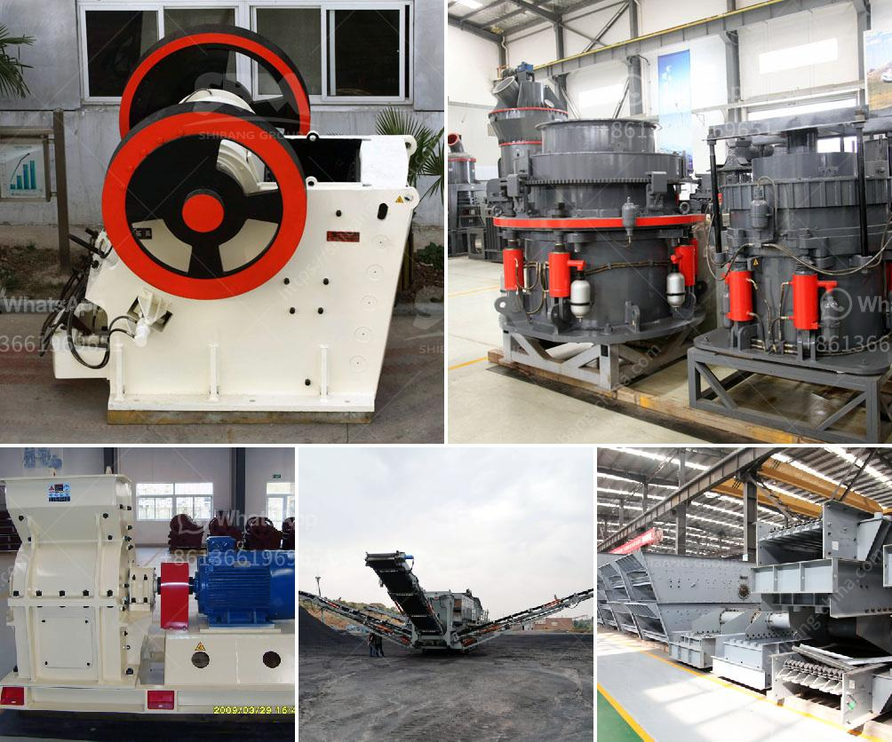

<h3>operating parameter of vertical roller mill</h3>
Vertical roller mills (VRM) have been utilized in the industry for grinding raw materials, coal, clinker, and various other cement additives. The VRM operates with a high-pressure grinding roll (HPGR) that runs in a fixed position against a table. As the material is passed underneath the roll, it is ground and pressed, resulting in a finer and more uniform product. The operating parameters of the vertical roller mill play a crucial role in achieving the desired product quality and energy efficiency. Let's take a closer look at these parameters.

1. Grinding Pressure: The grinding pressure exerted by the rollers is one of the key operating parameters of a VRM. It affects the grinding efficiency, material bed stability, and product fineness. Higher grinding pressure results in finer particles, but it can also lead to increased wear on the roller surfaces. Finding the right balance is crucial to achieving optimal performance.

2. Differential Pressure: The differential pressure across the VRM is another critical parameter that affects the mill's operation. It is the difference between the inlet and outlet pressures and indicates the amount of material that is being ground and transported through the system. Maintaining a suitable differential pressure ensures a steady flow of material and prevents clogging or blockages.

3. Table Speed: The speed at which the grinding table rotates in a VRM influences the fineness of the product. Higher table speeds result in finer grinding due to increased material retention time. However, excessive speeds can cause vibrations and lead to reduced process stability. It is essential to find the optimal balance between table speed and material grindability to achieve the desired particle size distribution.

4. Feed Size: The size of the input material significantly impacts the VRM's performance. Finer materials require less energy for grinding and result in higher grinding efficiency. On the other hand, larger particles necessitate more energy consumption and may lead to coarser product particles. Adjusting the feed size allows operators to optimize the mill's performance based on the specific material characteristics.

5. Moisture Content: The moisture content of the input material affects the VRM's grinding behavior and efficiency. Higher moisture levels increase the material's stickiness, potentially leading to agglomeration and reduced grinding ability. It is crucial to monitor and control the moisture content to prevent operational problems and ensure optimal performance.

6. Air Flow: The air flow rate through the mill also plays a vital role in achieving efficient grinding. Proper air circulation helps transport and classify the ground particles, improving overall productivity and product quality. Insufficient or excessive airflow can negatively impact the mill's operation, leading to reduced grinding efficiency and increased energy consumption.

7. Separator Efficiency: The efficiency of the separator in a VRM affects both the grinding process and the final product quality. The separator separates fine particles from the larger ones, ensuring a desired particle size distribution in the final product. Higher separator efficiency leads to finer grind and improved material classification.

In conclusion, the operating parameters of a vertical roller mill are crucial for achieving optimal performance and desired product quality. By carefully adjusting parameters such as grinding pressure, table speed, feed size, and air flow, operators can optimize the mill's efficiency, reduce energy consumption, and produce a consistent and high-quality product. Continuous monitoring and fine-tuning of these parameters are essential for maintaining stable and efficient VRM operation.
<h3>Contact us</h3><ul><li><strong>Whatsapp:&nbsp;<a href="https://wa.me/8613661969651">+8613661969651</a></strong></li><li><a href="https://swt.shibang-china.com/?git&amp;zhl&amp;operating parameter of vertical roller mill"><strong>Online Service(chat now)</strong></a></li></ul><h3>Related</h3><ul><li><a href='marbel grinding process.md'>marbel grinding process</a></li><li><a href='small rock crusher machine.md'>small rock crusher machine</a></li><li><a href='industrial vibrating feeder.md'>industrial vibrating feeder</a></li><li><a href='quarry stone dressing machine.md'>quarry stone dressing machine</a></li><li><a href='low cost jaw crusher price in uganda.md'>low cost jaw crusher price in uganda</a></li></ul>