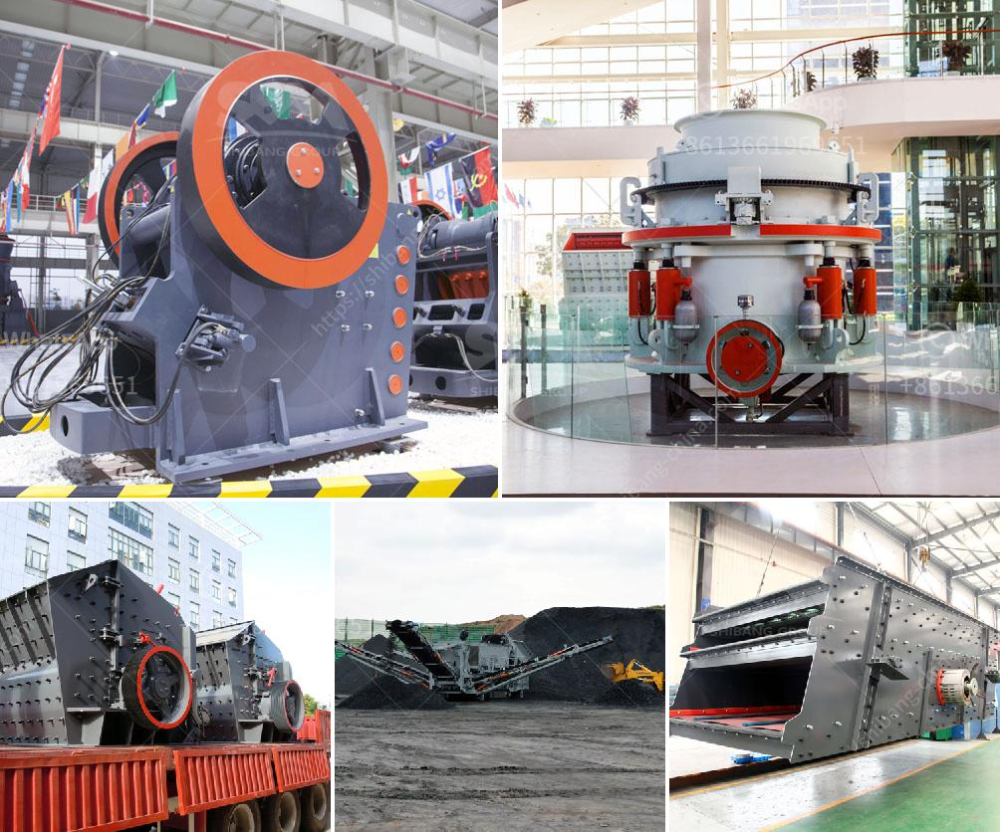

<h3>operation and maintenance manuals of cone crusher</h3>
Operation and maintenance manuals of cone crushers are valuable tools for owners and operators of these crushing machines. These manuals provide detailed guidance on how to operate and maintain cone crushers, helping to ensure their optimal performance.

Once the crushing chamber is optimized, many benefits can be gained, such as higher productivity, lower operating costs, and improved safety. However, achieving these benefits requires proper operation and maintenance of the cone crusher.

The operation manual of cone crusher includes several aspects, such as starting, stopping, adjusting, and maintaining. It is essential to carefully follow these procedures to ensure the crusher operates correctly and efficiently. Starting the cone crusher is not as complex as it may seem. The key is to follow the manufacturer's instructions and pay attention to any specific details or precautions outlined in the manual. Typically, the following steps are involved in starting the cone crusher:

1. Pre-operation checks: Before starting the cone crusher, conduct a pre-operation check to ensure all components are in good condition. Check for any loose or damaged parts and make necessary repairs or replacements.

2. Start-up sequence: Start the dust collection system and the associated equipment before starting the cone crusher. Once the system is up and running, start the cone crusher and allow it to run for a few minutes to warm up the bearings.

3. Check the oil level: Check the oil level in the lubrication system and ensure it is within the recommended range. Also, check the oil pressure and temperature gauges to ensure they are operating properly.

4. Monitor the crushing chamber: While the cone crusher is running, monitor the crushing chamber to ensure there are no blockages or foreign objects present. If any obstructions are detected, they should be removed immediately to prevent damage to the crusher.

The maintenance manual of cone crusher provides detailed instructions on how to inspect and maintain the crusher effectively. Regular maintenance is essential to ensure the cone crusher remains in good condition and continues to operate efficiently. Some important maintenance procedures that should be followed include:

1. Lubrication: Proper lubrication of the cone crusher's moving parts is crucial for its long-term performance. The maintenance manual provides specific instructions on how to lubricate the crusher's bearings, gears, and other moving parts. Regularly check the lubrication system and oil levels to ensure they are within the recommended range.

2. Wear parts replacement: As part of the regular maintenance schedule, the wear parts of the cone crusher, such as the mantle and concave, should be inspected and replaced when necessary. The maintenance manual provides guidance on how to identify wear and determine when replacement is required.

3. Cleaning and inspection: Regularly clean and inspect the cone crusher to remove any dust, dirt, or debris that may interfere with its operation. Inspect all components and check for any signs of wear or damage. If any issues are identified, they should be addressed promptly.

By following the procedures outlined in the operation and maintenance manuals, cone crusher owners and operators can ensure their crushers operate at peak performance and lifespan. Regular maintenance and correct operation play a significant role in maximizing the productivity and efficiency of cone crushers, ultimately resulting in cost savings and improved crushing capabilities.
<h3>Contact us</h3><ul><li><strong>Whatsapp:&nbsp;<a href="https://wa.me/8613661969651">+8613661969651</a></strong></li><li><a href="https://swt.shibang-china.com/?git&amp;zhl&amp;operation and maintenance manuals of cone crusher"><strong>Online Service(chat now)</strong></a></li></ul><h3>Related</h3><ul><li><a href='sayaji jaw crusher manufacturer.md'>sayaji jaw crusher manufacturer</a></li><li><a href='steel slag recycling plant.md'>steel slag recycling plant</a></li><li><a href='gypsum powder designed.md'>gypsum powder designed</a></li><li><a href='span of rock crusher equipment.md'>span of rock crusher equipment</a></li><li><a href='industrial roller mills.md'>industrial roller mills</a></li></ul>